## 

# Welcome

### System Requirements

TextSoap 9 for Windows. Supports Windows 10 or later.

---

### Welcome

TextSoap is an automated text processing tool that removes the tediousness of tasks associated with 'cleaning up' various text including removing extraneous characters, wrapping broken paragraphs, fixing quotation marks, finding and replacing patterned text, and more. It comes with more than 100 pre-built solutions and lets you create your own.

### Terminology

**Custom Cleaner:** - user-defined series of actions that can apply a pre-built cleaner or use one of the many building blocks like regular expression find and replace, changing style, etc.

**Custom Group:** - user-defined collection of `cleaners`. The collection can contain pre-built or custom cleaners.

See glossary for additional terms.

---

### Using TextSoap

TextSoap allows you to interactively process clipboard contents, text documents, create and edit custom cleaners and groups.

# Clipboard Workspace

### What is it?

The clipboard workspace is a special editing window that makes it easy to edit and clean up the contents of the clipboard in virtually automatic fashion. Skip the manual pasting in text after a launch and copying it to the clipboard before you quit the app. Clipboard workspace does this automatically.

You can disable the clipboard workspace via Preferences > General. When disabled, TextSoap will open an untitled document on launch, like most document-based apps.

### How does it work?

When TextSoap launches, the app creates a window and pastes in the current contents of the clipboard into that window for you.

You can then edit the text, clean it with any of the existing cleaners, manually find and replace text, and so forth until the text is satisfactory for your needs. While working with your text, you may use the clipboard as normal.

When you quit TextSoap, the app (automatically) copies the contents of the workspace window on the clipboard for you.

---

### Clipboard Workspace Workflow Example

Here is one workflow available to clean text with TextSoap:

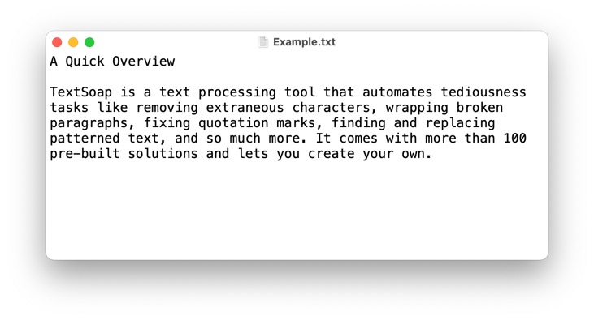

1. Open TextSoap app (contents of clipboard is pasted into Clipboard Workspace).

   If you have no selection, cleaners apply to the entire text. If you optionally select text, only the selected text is cleaned.

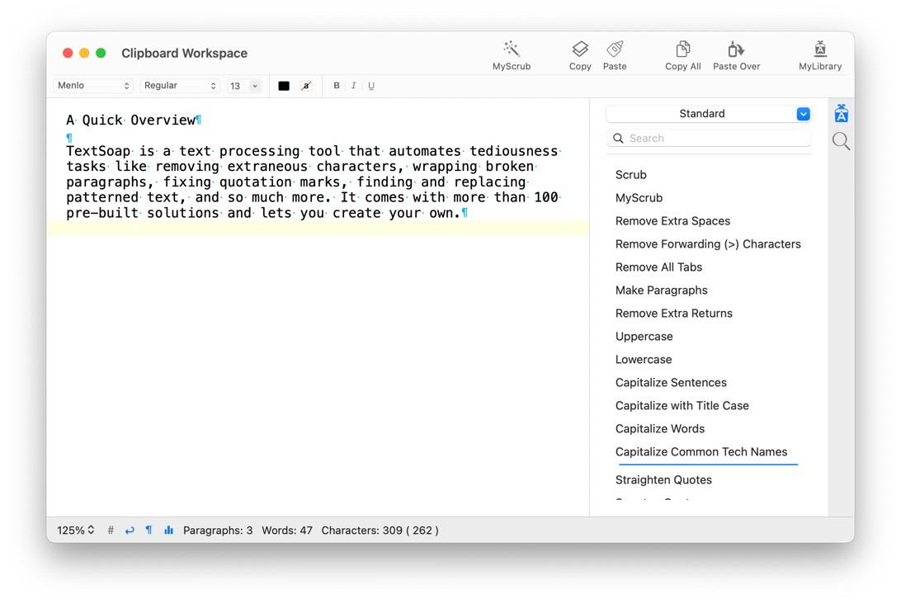

2. Find and click the `Uppercase` cleaner in cleaner list to apply it.

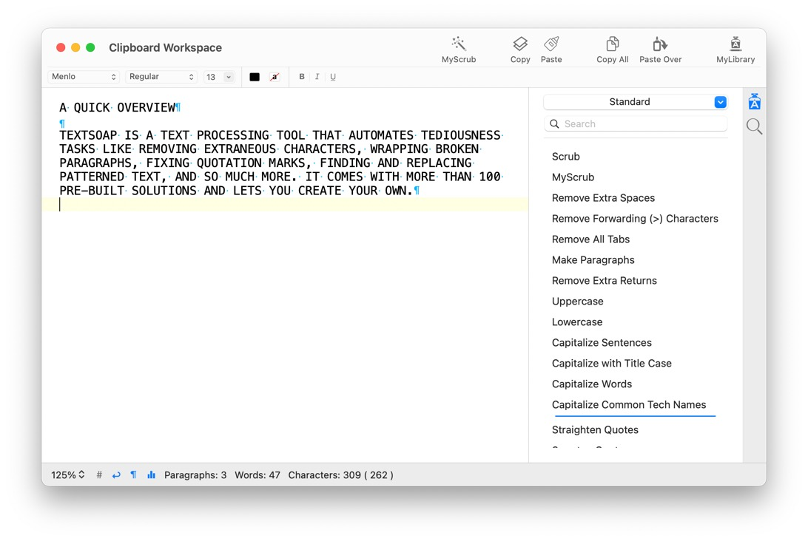

3. Quit TextSoap (text from Clipboard Workspace is copied back to clipboard).
4. Paste clipboard contents back into app.

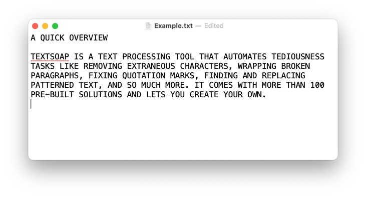

---

### Other integration options

The clipboard workspace is great option when you may need to do more than just apply a cleaner and need to possibly change the text manually.

# A Quick Tour

## Overview

TextSoap 9 focuses on content. The editor window used by the Clipboard Workspace and any documents you open provides minimal chrome. You can edit both plain and rich text.

### Toolbar & Inspector Bar


The toolbar actions:

- MyScrub : Apply cleaner specified by Preferences > General. Default is Scrub
- Copy : Copy text to the clipboard
- Paste : Paste text from the clipboard
- Copy All : Select all the text and copy it to clipboard
- Paste Over : Replace the existing text with the contents of the clipboard
- MyLibrary : Bring up MyLibrary editor to create or edit custom cleaners, or groups

Inspector Bar

- Changing font attributes of text. This applies for both plain text (where the changes apply to all the text) or rich text (where changes apply to selection).

### Editor Options

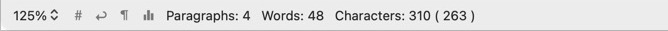

The actual editor can show you paragraph rulers for rich text. It also includes a number of options useful when editing various text. The options can be toggled on and off with either the View Menu or using the icon bar below the text.

- Zoom : Use Zoom to increase the size of your working text without actually changing the underlying size of the text.
- Line Numbers : Shows lines numbers representing each line (or paragraph) in the text.
- Text Wrap : Control whether the text wraps to the window or only to lines.
- Invisibles : Enable to show invisible characters such as tabs, spaces and returns in your text.
- Statistics : Quick access to the number of Paragraphs, Words, Characters and Characters minus spaces of your text.

### Sidebar

The sidebar is separated into sections providing interactive text processing. The sidebar maybe resized if you need more space to work with. If you just want to treat TextSoap as an editor, you may toggle the sidebar by clicking on the selected icon.

### Cleaner List

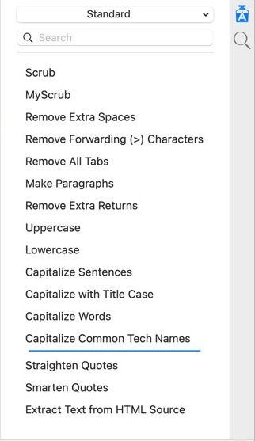

The cleaner list provides access to all the cleaners within TextSoap. Select your text, then select the cleaner to apply to the text. Preferences allow you to specify whether the entire document is automatically cleaned when there is no selection.

**Groups**: There are several pre-defined collections of cleaners (groups). You can also create your own custom groups of cleaners to suit your needs by using MyLibrary.

**Search**: The search can be be used to find cleaners. In addition to showing you matches within the current group, search will also search the contents of entire library for additional matches.

### Find Panel

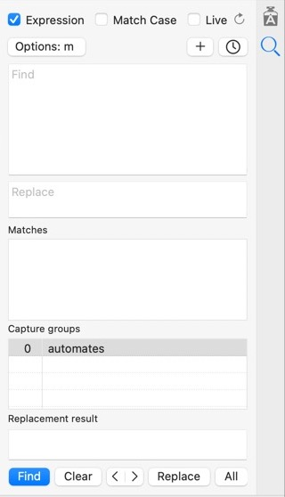

The find panel provides for interactive find and replace:

**Expression**: Enable to use regular expressions.

**Match Case**: Enable to require exact case match.

**Live**: Enable to the interactive match as you type.

**Options**: Find options.

**Insert**: Insert special characters or expression segments.

**Search**: History of searches.

**Find**: Find text field. Syntax highlighting is used when using regular expressions.

**Replace**: Replacement template field.

**Matches**: Each found match is listed here. Select the match to highlight it in your text.

**Capture Groups**: Shows a list of each capture group of the selected match.

**Replacement result**: Will show the replacement result of each match using the template.

**Find**: Find all the matches using the find field & options.

**Clear**: Clear find matches.

**Previous**: Select the previous match in the list.

**Next**: Select the next match in the list.

**Replace**: Perform a single replace on the selected match. Then select next match.

**All**: Perform a `Replace All` using the find & replace fields with current options.

# Cleaner Groups Summary

### Groups

A group is simply a collection of cleaners. Groups provide a great way to organize cleaners for a specific task or project. There are two types of groups: built-in and custom. Built-in groups cannot be edited. Custom groups can be created and edited by you.

Within a custom group, you can specify which cleaners are included, their order, at (optionally, their color). The cleaners listed in a group can be either built-in cleaners or any custom cleaner.

### Built-in groups

- Library - A list of all the cleaners available to TextSoap.
- Standard - A list of the more commonly used cleaners plus custom cleaners.
- Basics - A list of the more commonly used cleaners.
- Email - A list of cleaners useful in dealing with emails.
- Typographical - A list of cleaners for handling typographically related text processing, such as Ellipsis, Em Dash or En Dash conversions.
- Case Conversions - A list of cleaners related to change text case.
- Text Quoting - A list of cleaners to help when quoting various text.
- Dates - Date formatting options that include using the System Preferences or one of the more common date formats (like MM-DD-YYYY, DD-MM-YYYY, or YYYY-MM-DD).
- Remove Extraneous - A list of common cleaners used when removing extra characters.
- Paragraph Rulers - A list of cleaners related to change paragragh ruler settings.
- Markdown - A list of cleaners related to Markdown formatting.
- HTML - A list of cleaners to work with raw HTML text. It includes cleaners that tag text with a variety of pre-defined HTML tags.
- Custom - A list of cleaners created by end-users.

### Editing Custom Groups

You can access your custom groups (for editing) using the Navigator. Simply double-click on the custom group you wish to open.

To create a new group, select the plus (+) sign to add, and select `New Custom Group`.
To duplicate an existing group, select the group and select the duplicate button.

See [Customize > Editing Custom Groups](#custom-group-editor) for additional information.

# What's New in TextSoap 9

- General
  - New interface
- New Custom Cleaner Actions
  - Define List action
    - Self contained lists items can be copied/pasted between cleaners
    - Lists can be defined anywhere within a cleaner.
    - Resizable List/Table editor
    - Define each list with 1 to 4 columns
    - Optional text-based editor allows editing list as tab-delimited text lines.
      - To edit as text, hold down option key when clicking edit button.
  - For Each Line action
    - Simplifies processing all non-blank lines
  - Repeat Action
    - Repeat contained actions a specified number of times.
  - Process List action
    - Define variables for each row in selected list with your actions
    - Use special variables with Find/Replace, If Text Matches to quickly process mulitple find/replace
- Updated Custom Cleaner Actions
  - Find & Replace actions
    - List support added (replaces Batch Find & Replace)
    - More prominately displays option values (m,s,w,x) for Regex
    - Defaults to most common regex option: m - match lines, enabled.
    - More prominately displays granularity for plain text finds
  - If Text Matches action
    - Search history option added
    - Insert special characters option added
    - Now only displays valid capture groups, based on given regular expression.
  - Sort Lines action
    - New options added:
      - Match case
      - Ignore diacritic marks
      - Skip leading whitespace for comparison
      - Sort numbers as values
      - Use a regular expression for comparison
  - If-Match (aka Conditional) actions
    - Integrated option to modify results (invert, skip, limit results of match)
  - Set Underline/Strikethrough action
    - New `By Word` option
  - Extract Characters action
    - Replaces Extract Beginning Characters, Extract End Characters, and Extract Middle Characters
- New Cleaners
  - Ruler: Clear All Tab Stops - clear all tab stops from selected paragraph rulers.
  - New BBCode-related tag cleaners
  - Enable Ligatures, Disable Ligatures
  - Remove Line Numbers - removes line numbers at the beginning of each line.
- Text Editor
  - Cleaner groups now more prominent
  - Sidebar is now resizable
  - Improved handling of line numbers
  - When using regex, each match selection also displays its
    - capture group list
    - replacement text result
- My Groups Editor
  - New editor in a single window interface.
  - You can use an existing group as a template for creating a new group.
  - Item tags replace colors, dynamically adjusting for Light / Dark Mode.
- My Cleaners Editor
  - New editor in a single window interface.
  - Actions display options inline for a more compact display, where appropriate
  - Container actions are more visually distinctive
  - Container actions show number of contained actions
  - New color scheme for action categories
  - Disabled actions strikeout title
  - Disabled actions no longer allow editing
  - Action comments can contain returns & tabs
  - More robust auto-resize handling for actions with text fields
  - Preview window shows invisibiles in cleaned text preview
  - Improved performance when cleaner contains a lot of actions
  - New find actions are now based on text search preferences
- New Preferences
  - Presentation
    - Appearance: use Light or Dark Mode or System theme
  - Text Editing Interactive Search Defaults:
    - Search type
    - Match Case option
    - Match Lines option (for Regex)
- General Improvements
  - Action colorization provides dynamic color support between Dark/Light mode.
  - Regex syntax coloring supports Dark/Light mode.

# Cleaner Editor

A custom cleaner is one or more user-defined actions that can be applied to text. For example, you can use a `Find and Replace` text action to set up an automated find and replace on given text. This action can include regular expressions, a powerful text matching syntax. Another example might be to apply another cleaner (either built-in or custom), and then add additional actions, allowing you to build on existing cleaners.

### Text vs. Style

TextSoap supports working with both plain text and rich text. When working with rich text, the text formatting (style) of the text plays an additional role.

You can make text change actions on rich text and TextSoap will attempt to maintain the existing character styles from the original text. This means that bold words stay bold, italic words remain italic, and underlining, fonts and text color stays intact, even as the text is updated.

TextSoap also enables changing the underlying (character-level) format of your text. This is useful if you need to strip out existing styling like bold or italic, adjust the font, or size. TextSoap can perform the style changes selectively based on the underlying text.

> [!IMPORTANT]
>
> Microsoft Word text may also use Stylesheets for formatting. Unfortunately, standard RTF support does not extend to using document-based stylesheets. TextSoap is unable to support maintaining these styles.

### Overview

The MyLibrary editor provides you with a single window interface for all your cleaners. A list of cleaners is displayed on the left along with some additional options: Import, Export, Remove.

- **Import:** Enables you to add cleaners from libraries or cleaner files. You select the files to import using the system dialog or drag the files into the window.
  - You can add multiple files
  - You can selectively import the individual cleaners from within a file.
- **Export:** Enables you to save one or more cleaners. Cleaners can be saved as individual files or combined into a single library file. Used these files as backups or to share your cleaners with others.
- **Remove:** Allows you to delete multiple items (both cleaners and groups) in one action. TextSoap will prompt you one more time before deletion.

**Buttons:**

- **Add:** Add a new cleaner or group.
- **Duplicate:** Duplicate the selected item.
- **Export:** Export the selected item.
- **Delete:** Delete the selected item.

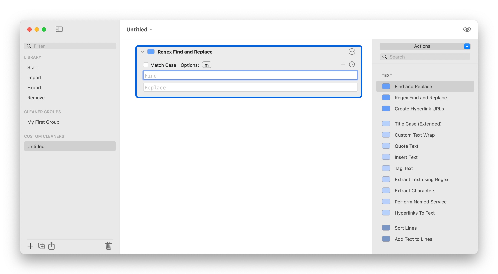

### Action Workspace

The action workspace defines the currently selected cleaner.

- **Cleaner Name:** Change name or other properties (author or description) of a cleaner. Click on the name at the top to display and edit its properties.
- **Preview:** Quickly test the current cleaner using the text in the clipboard workspace (or other specified open document).
- **Action Toolbox:** Categorized actions that you can add to a cleaner.
  - **All:** combination of Actions & Cleaner actions.
  - **Actions:** core actions within a cleaner you can add.
  - **Cleaners:** Existing cleaners can be called as actions.

Actions have common attributes:

- **Show Details:** toggle details of an action
- **Name:** type of action
- **Additional properties:** Disable (or enable) and edit comment for specific action

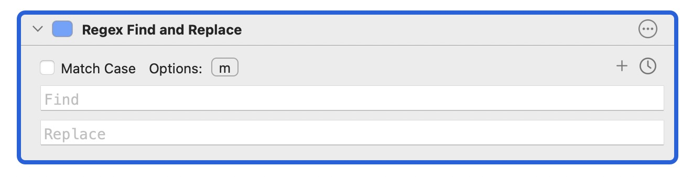

If action is disabled, the title is struck, details are hidden (and are no longer editable).


Any comments are displayed as a tooltip when you hover your cursor over the title of the action.

**Container Actions**

This class of action can contain other actions, much like a folder holds files. They can be used as an organization tool (a simple Group action) or used to limit the text you wish to further work on (a Conditional). Containers have a visible notch to redirect your eye in the workflow, making the hierarchy easier to see.

When a container action is disabled, the contained actions will NOT be executed.

Additionally, containers have:

- **Disclosure Button:** Toggles whether items are displayed. Works similar to Finder's folders.
- **Contained Count:** Indicates how many direct items are contained.

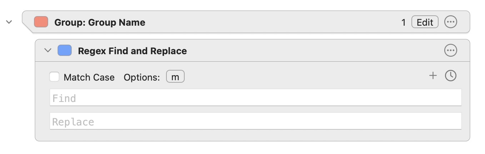

See [My Cleaner Actions](#my-cleaner-actions) for descriptions of the various core actions.

# My Cleaner Actions

### Find and Replace Actions

**Common options:** These options are common to the collection of Find and Replace actions. Specific changes for each action will be noted below.

**Regex** - Indicates whether this is a regular expression

**Match Case** - Require case matching, otherwise ignores text case (Uppercase A = Lowercase a)

**Options**

**_Textual matches_**

- **Contains:** match text anywhere
- **Starts with:** Start of match must be start of word
- **Whole Words:** Do not match partial words
- **Ends with:** End of match must be at end of word

**_Regex matches_**

- **Matches Lines (m):** Control the behavior of `^` and `$` in a pattern. By default these will only match at the start and end, respectively, of the input text. If this flag is set, `^` and `$` will also match at the start and end of each line within the input text.

  Sometimes called `Multiline`.

- **Dot Matches Returns (s):** If set, a `.` in a pattern will match a line terminator in the input text. By default, it will not.

  Note that a carriage-return / line-feed pair in text behave as a single line terminator, and will match a single `.` in a RE pattern. Line terminators are `\u000a`, `\u000b`, `\u000c`, `\u000d`, `\u0085`, `\u2028`, `\u2029` and the sequence `\u000d \u000a`.

- **Use Unicode Words (w):** Controls the behavior of \b in a pattern. If set, word boundaries are found according to the definitions of word found in Unicode UAX 29, Text Boundaries.

  By default, word boundaries are identified by means of a simple classification of characters as either `word` or `non-word`, which approximates traditional regular expression behavior. The results obtained with the two options can be quite different in runs of spaces and other non-word characters.

- **Allow comments (x):** If set, allow use of white space and (#comments) within patterns

**Find** - Text to find


**Replace** - Text to replace

#### Changing text case when replacing using regular expressions

TextSoap supports additional commands to change the case of the replacement text.

```markdown
Cmd - Action
$U  - All future text is uppercased
$u  - Next character is uppercased
$L  - All future text is lowercased
$l  - Next character is lowercased
$E  - All future text case is preserved
```

You can use $u and $l with the capture groups. For example, on the following text:

The big brown fox jumped over the blue cow

**Find:** `(b\w+)`

**Replace:** `$u$1`

Will capitalize the first letter of first capture group, the result is:

The Big Brown fox jumped over the Blue cow

Where all the matchees (words that start with b) are capitalized.

#### Find and Replace with List

**List** - When you specify a list, the action will repeat for each row in the list, replacing references to `$v{A}, $v{B}, $v{C}, $v{D}` with the value in the specified column for the row.

If you need to specify `$v{..}` w/o the preprocessing, use `\`.For example: `\$v{A}` would find `$v{A}` and not be replaced in the list processing.

**Note:** For more advanced functionality, you can use the **Process List** action. However, do not use **Find and Replace with List** within a Process List group.

---

### Find and Replace Text

Regular text fields may use the following special characters

```markdown
\\ = backslash (\)
\t = tab
\n = end of line (return)
\s = space
\x{hhhh} = hex character value, ie. tab = \x{09}, space = \x{20}
```

### Regex Find and Replace Text

When Regex option is selected, find text is a regular expression and is highlighted as such. See Reference on Regular Expressions for more details.

Replace text supports both the characters supported in regular text fields (`\t`, `\n`, etc) as well as replacement template (`$0` for entire match, `$1` for first captured group, etc).

### Create Hyperlink URLs

This is a special variant of Batch Find and Replace Text action.

Use the find field to match the text (most common is simple text match, but you can use an expression as needed). Use `$v{col:A}` to specify the column A value. See above on `Using Lists` for more details on specifying the columns within the list.

The `replace` value is somewhat unique. The replace field specifies the text used in the hyperlink. If column B specifies a complete URL, you can simply use `$v{col:B}`.

## General Actions

### Title Case (Extended)

TextSoap has a built-in cleaner called `Capitalize with Title Case`. However, if you need a more customized behavior, you can use this action, which provides for extending or replacing both the small words list, and the special words list used.

Small words specify words that are to not be capitalized.
Special Words specify words that are keep the case as specified in the list.

You can often use this in combination with the `Capitalize Common Tech Names` cleaner, which will fix up special-cased words like MacBook, iPhone, TextSoap, etc.

### Custom Text Wrap

TextSoap has built-in cleaners to hard wrap text at 50, 60, and 70 character boundaries. You can use this action to specify a custom value. The custom wrap will word wrap the text, attempting to keep lines <= the specified character length.

### Quote Text

Quoting references an old style quoting where a common mark such as `>` is used before text to quote some previous text.

The options include:

**Quote level (0-10):** specifies how many of the `Mark` characters to use.

**Wrap text:** allows for re-wrapping the text at a fix character length

Quote Chars:

**Prefix:** typically a space to provide padding

**Mark:** The character used to quote. Commonly `>`, but can be any character.

**Suffix:** padding after the mark.

### Insert Text

Allows for inserting a piece of text either before, after or replacing the text.

### Tag Text

Allows for simple tagging of text. Often used as part of a conditional (see below).
While HTML tags are most common, you can specify any tag and it will surround the given text with the open tag and close tag.

### Extract Text

**Expression:** Regular expression to match the text to extract.

**Capture Group:** Result group to use. $0 indicates entire match, but you can specify a sub group.

**Match Case:** Indicates whether to require case matching. If not selected, text case is ignored.

**Append Result:** If selected, will return original text along with extracted text appended. Otherwise, will replace the text with the extracted text.

### Extract Characters

This action will extract the specified character count from the given text.

- **From Beginning:** Specify number of characters from the beginning of text.
- **From End:** Specify number of characters from the end of text.
  result, where n is number of characters.
- **Starting At:** Specify the starting position and length of the text.

### Hyperlinks to Text

This action will find rich text with a link attribute and extract the link out as specified.

Result Pattern: text template used to extract the link. Default demonstrates how to convert to the HTML `<a>` tag.

```html
<a href="{link}">{text}</a>
```

Note: Special tokens will substitute the original text `{text}` and the link, `{link}`.

Keep hyperlinks active : optionally keep the link specified as clickable.

### Date Formatter

This action will format dates in the preferred order. It can replicate all of the built-in Normalize Dates cleaners. In addition, it supports DateNow expansion as well.

**Date** - Determines whether you are working with existing dates found in text or expanding `${DATENOW}`

**Date Format**

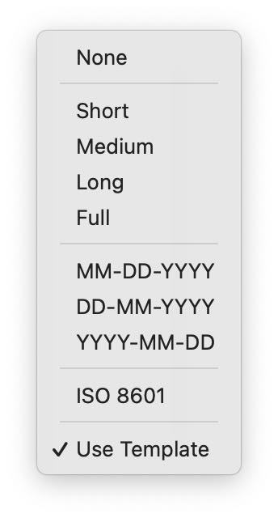

If choosing None, Short, Medium, Long, Full, can also specify the **time format**.

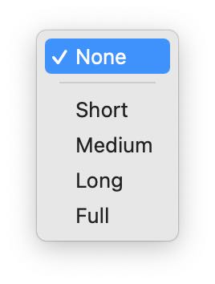

**Template**

When specifying Template format, full customization is available. The following chart gives all the various template keys when formatting dates and times:

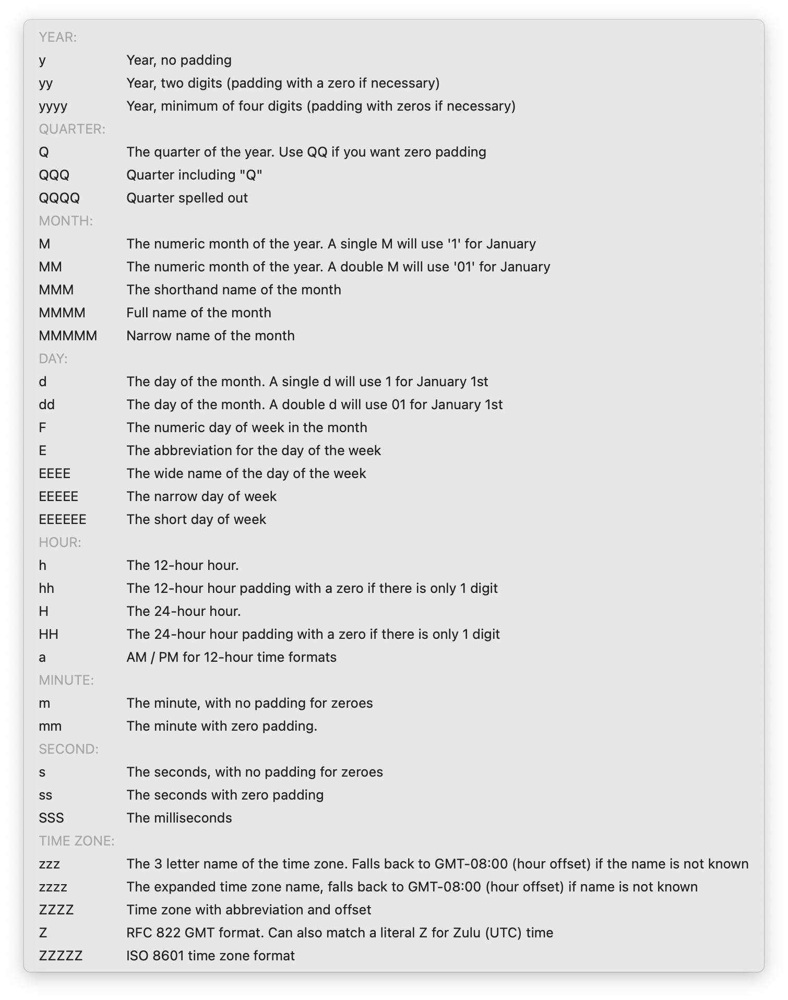

## Line Actions

### Sort Lines

This action lets you sort the lines of the given text.

- Reverse sort : Sorts in descending order
- **Match case:** When comparing, match based on the case of text.
- **Numbers match by value:** Mimic Finder's numeric sorting of numbers.
- **Ignore whitespace:** Any whitespace at the beginning of the line is ignored.
- **Ignore diacritic marks:** Any diacritics are ignored. Example: ä = a
- **Use expression:** Use the regular expression & result template to transform the line before comparing.

### Add Text to Lines

Add text to the beginning or end of each line of text.

### Remove Text from Lines

Remove given text from the beginning or end of each line of text. Ignored if the given text is not found.

### For Each Line

Convenient approach to operating on each line individually. Text is divided up into lines (using return markers), and then actions contained in the For Each Line group are applied.

### Number Lines

**Lines: All, Non-Empty. If Non-Empty is selected, will skip over lines that are just returns.

**Start**  Starting number

**Increment:** Increment for each number.

**Format**: A simple formatting string that provides for padding, tabs and spaces

```markdown
0  - minimum padding. 0 = No padding (1), 000 = 3 digits min (001)
\t - tab character, Useful for using tab to separate line number and text.
\s - space character. optional. More obvious than a just a " " character (which also works)
```

## Style Actions

When working with rich text (vs. plain text), you can change various attributes of the text. These actions can be used globally (for example, to change a font) or selectively on text using conditionals.

### Set Font

An option is applied only if selected. To change only one aspect of a font, leave the remaining options unselected. For example, to set the font, but keep existing sizes, along with bold and italics, only select the `Font family` option and specify the new font family to use.

Font family: The font name to use. For example `Helvetica Neue`.

**Typeface:** When selected, specify plain (to remove any bold & italic), bold and/or italic. Plain option overrides bold and italic.

**Size:** The size of the font to use.

### Set Exact Font

**Note:** Use more sparingly to specify the exact font name. This allows for additional choices outside of more standard `bold` and `italic`.

**Exact font:** The exact font to use. For example `HelveticalNeue-MediumItalic`

**Size:** The size of the font to use.

### Set Style

A subset feature from Set Font, which changes the typeface style. Useful if wanting to simply bold or italicize text.

_If using **Set Font**, specify the style there. **Set Style** is not necessary and will just cause additional processing of the text._

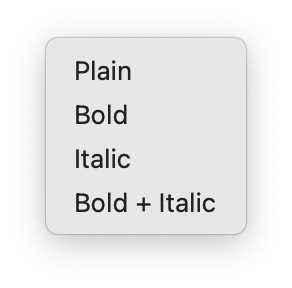

### Adjust Font Size

Relative changes to the font sizes. To make everything 5 points larger, set to +5. 12pt becomes 17pt, 20pt becomes 25pt. To reduce everything by 10 pts, set to -10 pts. 24pt becomes 14pt, 48pt becomes 38pt.

### Set Underline Attributes

**Style:** Single, Thick, Double to specify line style. None = remove this attribute (if it exists).

**Pattern:** Line patters defined in Apple's Rich Text.

**Color:** Color of the line.

### Set Strikethrough Attributes

Style: Single, Thick, Double to specify line style. None = remove this attribute (if it exists).

**Pattern:** Line patters defined in Apple's Rich Text.

**Color:** Color of the line.

### Set Super/Subscript Attribute

Script attribute:

- **Superscript:** make text superscript
- **None:** remove any superscript/subscript attribute
- **Subscript:** make text subscript

### Set Text Color

Set color of text.

### Set Background Color

Set color of background.

### Remove Character Attribute

Remove the specified attribute of text.

## Conditionals

Conditional blocks are a way to apply specific actions only to text that matches given criteria. The actions inside the block can be virtually anything. Conditionals can even be nested to allow you to match more and more specific criteria. Using nest conditionals, it is possible to find words that are both bold and all uppercase. This example finds all capitalize bold words and changes the text color to red.

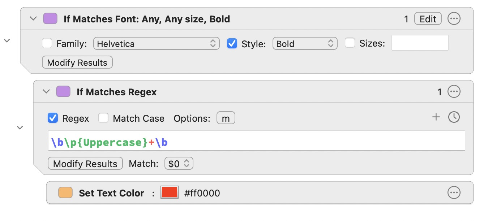

#### Modify Results

This option enables you to adjust the results of a match.

- **Invert Matches:** This will flip the match results. For example, if you used a conditional to find bold words and then used invert matches, the match would be on all non-bolded words.
  In some cases, it is easier to specify the text you don't want and then invert the results.
- **Limit Matches:** If multiple matches are found, this will limit the matches used.
- **Skip Matches:** If multiple matches are found, this will skip the first N matches.

### If Text Matches

Find the provided text and applies related actions to it.

When using a regular expression, you can also specify which capture group to use. `$0` is the default for entire matched string. However, you could specify a find as `<tag>(.\*?)</tag>` and use `$1` to only specify the text within the given tag.

### For Each Line

Process each non-blank line of the text. This action does not support modifier options.

### If Font Matches

Finds text that matches the font family, size(s), or face attributes (italic or bold). All the attributes can be found independently of each other. For example, you can specify Typeface: Italic to only find italic text, no matter its font family or size.

### If Text Has Attribute

Finds text that matches the specified attribute.

---

## Misc

### Group

Group containers encapsulate a hierarchy of actions. They represent the foundation for conditional actions and macros.

Additionally, they allow for encapsulated organization of actions. A group container controls whether the actions within are applied. If the container is disabled, all the contained actions are ignored. This is much easier than individually disabling actions.

If you move the group, all its contained actions move with it. And if you delete a group, all the actions within are deleted.

### Define List

You can define a table of data which can be used with other actions.

The table consists of rows with up to 4 columns of text. You can copy or paste tab-delimited text and use drag-n-drop to re-arrange rows.

Click Edit to display the table editor.

- **Bonus:** Hold down the option key when you click Edit to edit it as tab-delimited text. Each line of text represents a row. Any columns defined past 4 are ignored.

### Run Automator Workflow

This action runs an Automator Workflow.

_Note: The result of this action will be plain text_

### Note

This is a basic action that allows you to store notes within your cleaner. This is useful if you need to add a note to remind yourself of some detail in your cleaner. It does nothing to the text (it is ignored) when the cleaner is applied.

Additionally, if you want to make notes for a particular action, you can use the comment button on the individual action to store a short note with it.

### Delete Text

Simply deletes the provided text. This is most commonly used as part of a conditional.

<!--

### Copy Text to Clipboard

Will copy the current text to the clipboard. You might use this at the end of a cleaner to always place the results on the clipboard.

-->

## Macros

Macros are way to specify a group of actions that you can use multiple times within a custom cleaner. Rather than duplicating the actions, you can create a macro with the actions and apply it instead.

### Define Macro

This action defines a Macro. It is also a group container. You specify the name of the Macro (which will be used later with the `Apply Macro` action). Add your actions to this group container.

Note: The contained actions within will only be applied using Apply Macro action.

### Apply Macro

To apply the actions defined within a Macro, use this action. It provides a popup list of names defined macros within the cleaner. The contained actions of the Define Macro group will be applied to the given text.

---

Here is a slightly altered version of our cleaner example:

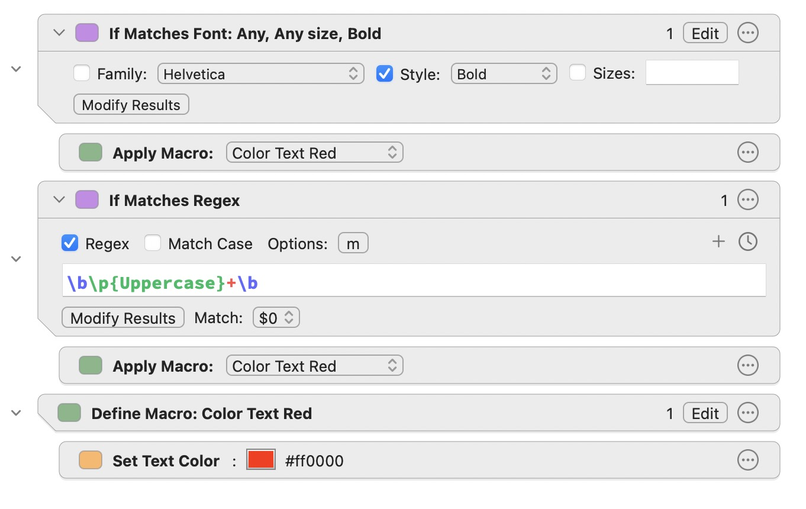

Explanation: In this example, you create a macro the changes the text to red.

Instead of nesting the two conditional actions, they are separated, which means any text that is bold, or any words that are all uppercase will have the macro applied, changing the text to red.

If you wanted to change the text color to green, it now requires only one change. You can add additional actions to the macro definition and they will use used everywhere the macro is applied.

# Custom Group Editor

### Overview

A custom group is a collection of cleaners, either pre-built or custom, along with optional labels and dividers providing quicker access to cleaners used for a specific task.

When you create a new custom group, it can optionally be based on an existing group.

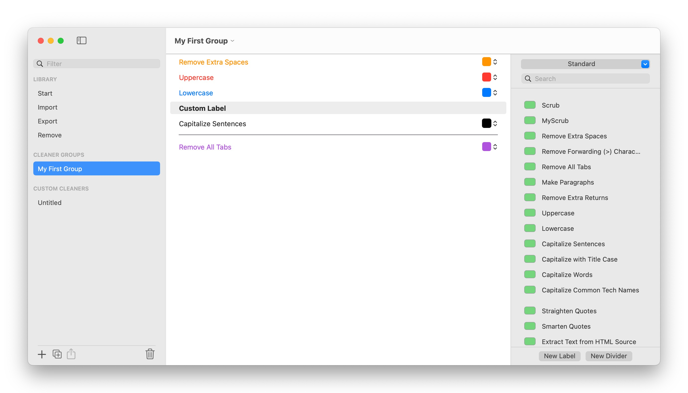

### Editing

The group workspace defines the currently selected group. You can rename the group by clicking on its name at the top and editing the name.

The workspace contains the list of cleaners, labels and dividers, referred to as group items.

To add a desired cleaner group item, find it in the list on right and either double-click on the name to add it, or drag the cleaner item into the group. Double-clicking will be appended to the current list. There are options to insert a label or a divider using the buttons at the bottom of the list.

You can directly manipulate group items within the list:

- Drag items to rearrange them.
- Change the color using the popup button. Black/White (Automatic) will display text as black when in light mode and as white when in dark mode. Each of the other colors will adapted based on the whether the app is in light mode or dark mode.
- Select the item and press Delete key (or select Edit > Delete) to remove the item from the list.
- Double-click on the label to change its text.

# Your First Cleaner

### Tutorial

The best way to learn about custom cleaners is to jump in and create one. Let's create a simple custom cleaner to fix any places where TextSoap is not properly capitalized. We have some sample text above to test against.

First we create a new cleaner and give it a useful name. Let's call it `Fix TextSoap Spellings`

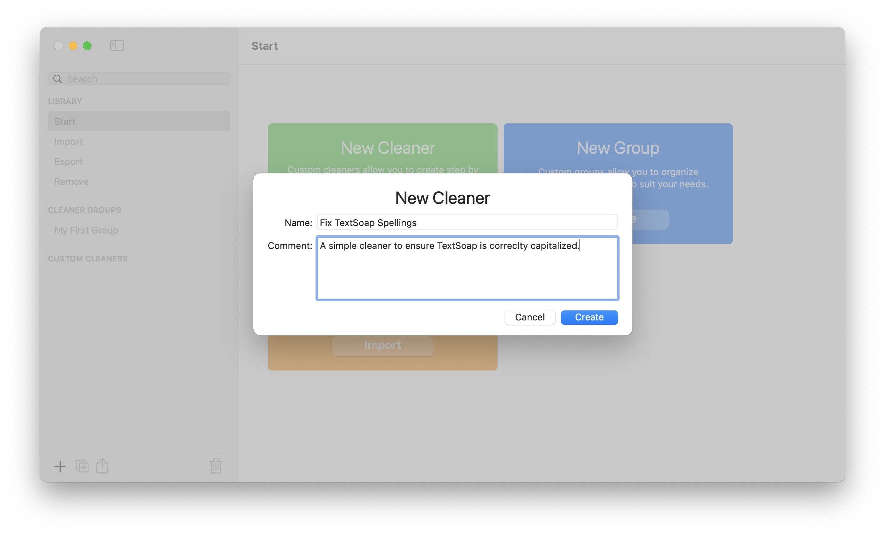

Next, we'll add an action. For this tutorial, you will want to select the **Find and Replace** action.

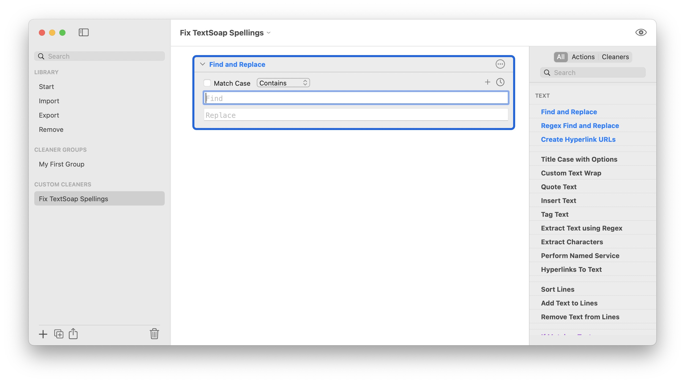

In the Find field, enter `textsoap`
In the Replace field, enter `TextSoap`

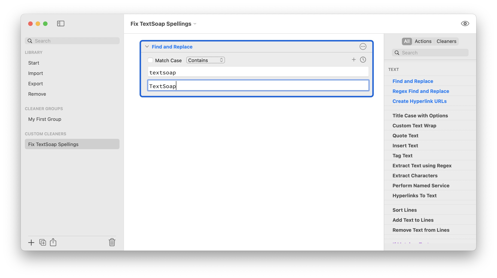

We can test the cleaner with some provided sample text. Select, copy and then paste the following paragraph into the clipboard workspace (or a new text document).

### Text Sample

---

Sample text: Textsoap offers a collection of tools to automate tedious manual text changes. textSOAP can save you time and increase your productivity. Once people use textsoap, they quickly find it indispensable.

---

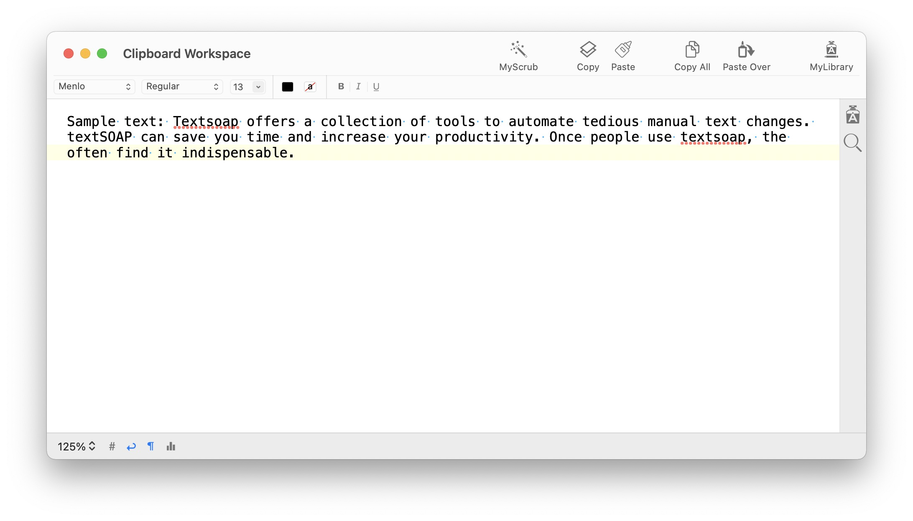

Select the Preview button on the top of the window to test your cleaner.

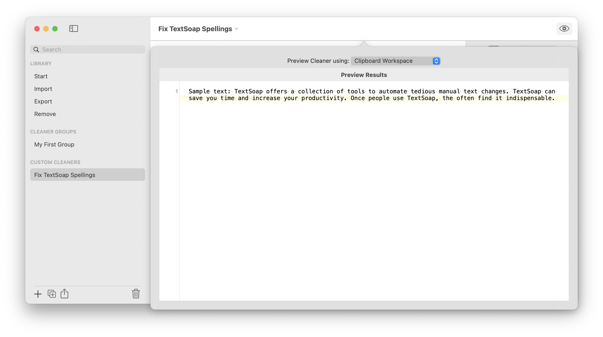

**How This Cleaner Works**

By default, the Find and Replace Text action ignores case with text matching. If you need to match text specifically with case, remember to select the `Match Case` option.

In our case, `Textsoap`, `textSOAP` and `textsoap` will all match with the `textsoap` search. The action then replaces the found text with the correctly cased version `TextSoap`.

#### Congratulations!

You have created your first custom cleaner. You can now use this custom cleaner just like any of the pre-built cleaners.

# Removing parameters from a URL

## Tutorial

We're going to create a cleaner that takes a given URL and removes the extraneous parameters attached to it, leaving the main URL intact.

Original:
http://test.com/directory/123?utm_source=google&utm_medium=email&utm_campaign=newsletter

Desired Result:
http://test.com/directory/123

We accomplish this with a custom cleaner, using a **Regex Find and Replace** action.

Create a new cleaner and give it a useful name.

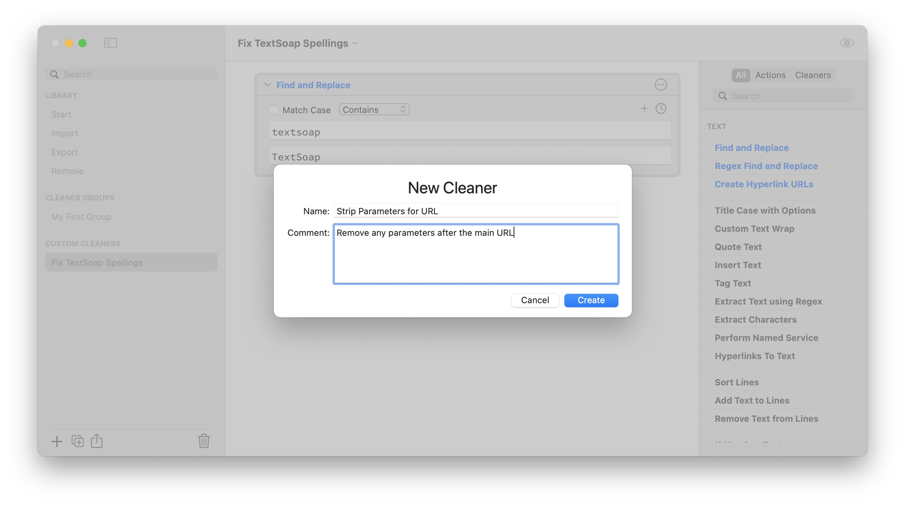

Add a Regex Find and Replace action.

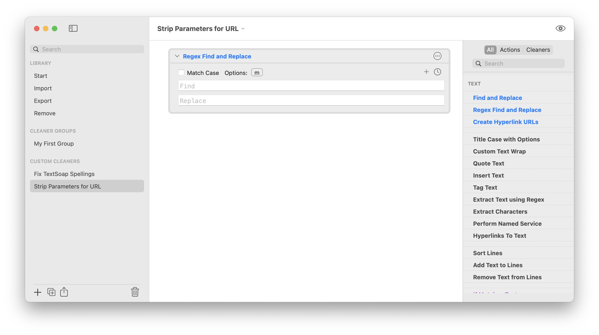

Now for your regular expression. We'll break this down in a minute. Regular expressions provide a powerful way to match text based on characteristics of text.

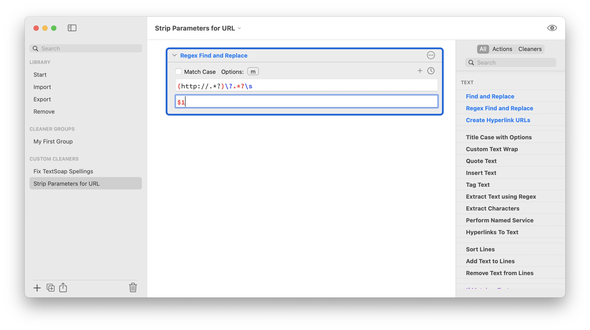

Here is the expression we're trying to use to match the text.

`(http://.*?)\?.*?\s`

Let's break it down:

`(http://.*?)`

find and capture URL starting with http:// and any characters (non-greedy)

`\?`

literal ? in expression

`.*?`

all the text that follows the literal ? . This is also non-greedy so we can match the first whitespace we hit with the next part.

`\s`

whitespace character. Any tab, space, return that indicates the end of the URL.

The (non-greedy) match any character sequence `.\*?` allows you to find http:// up through the `?` It acts as a simple wildcard character. Non-greedy means it will find the shortest match possible.

The parentheses allow you to capture part of the matched text. In this case we want to capture everything from the http:// until we get to the `?` (which is the delimiter for parameters in a URL). We can later use that captured string.

When replacing a regular expression match, you can use the some special values to indicate parts of the matched text.

`$0` is used to indicate the entire match (for example, if you wanted to augment your text)
`$1` specifies the first captured group. In our case, it is the base URL.

So we enter in `$1` as the replacement for the match.

We can now test the cleaner. We'll place the previous text into the clipboard workspace (or an text document in TextSoap).

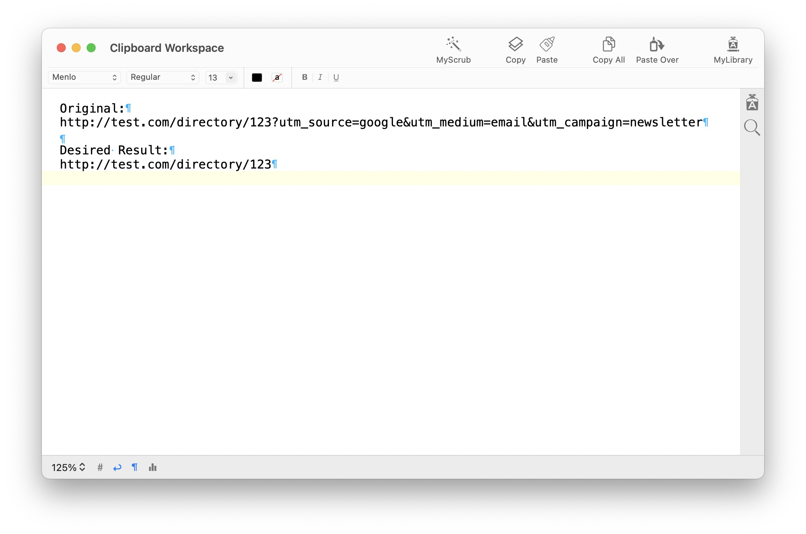

Select the preview button at the top of the custom cleaner editor to test the cleaner.

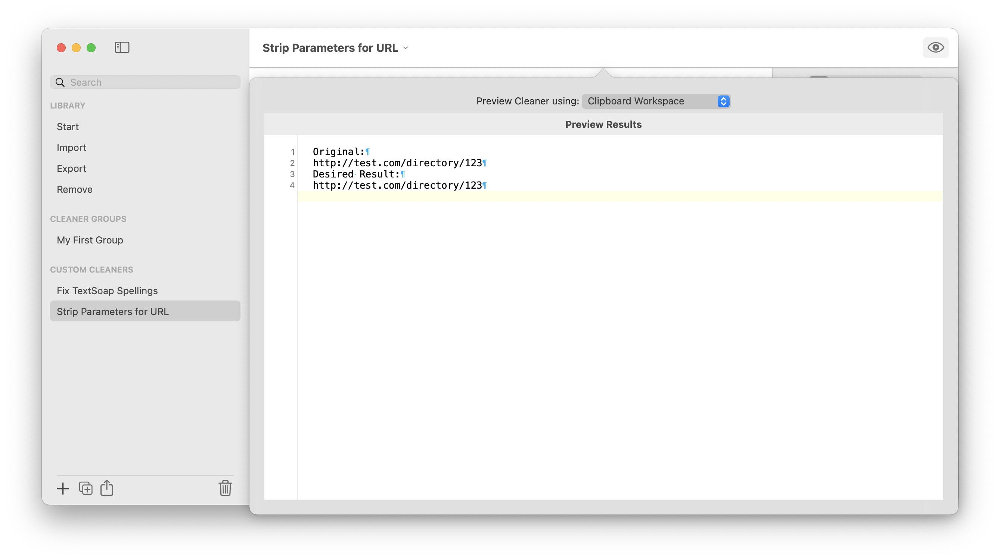

In our test, we see that we also lost a blank line. That's because we matched a whitespace character, but didn't keep it. This would also cause URLs to smash up against any words that followed it.

Let's fix this. We'll capture the whitespace (which could be a space, a tab, a return) and make sure it's included.

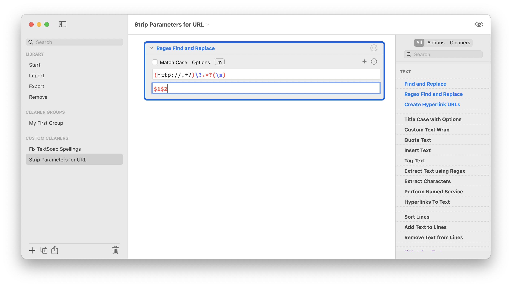

We placed parens **( )** around the \s to capture the whitespace that follows the parameters.
And then we add that captured group to our replacement string.

And now our test looks correct:

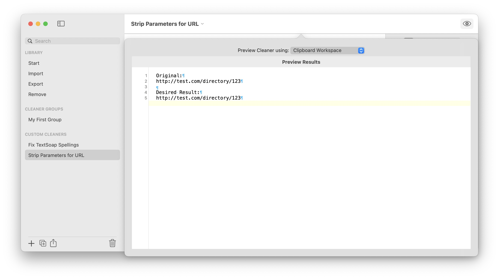

# Using Lists in Your Cleaners

## Tutorial

Lists are a powerful feature in TextSoap. Rather than creating individual find and replace actions for each piece of data, you can create a template find and replace action and connect it to a list of data. The action is then applied with each row of the data.

The following actions currently be used within lists:

- Find and Replace Text
- Create Hyperlink URLs
- If Matches Text

Let's create an example using Create Hyperlink URLs. This action will take matches found in column A and convert them to hyperlinks in Rich Text using the link address in column B.

For URLs like https://www.unmarked.com or https://www.apple.com, we could just use the cleaner 'Convert URLs to Hyperlinks'. In this example, we will take it one step further. We will take references to 'Unmarked Software' and 'Apple and link them to the appropriate URL.

First, we will create a new cleaner and call it `Lists Example`. Then we will add a **Define List** action.

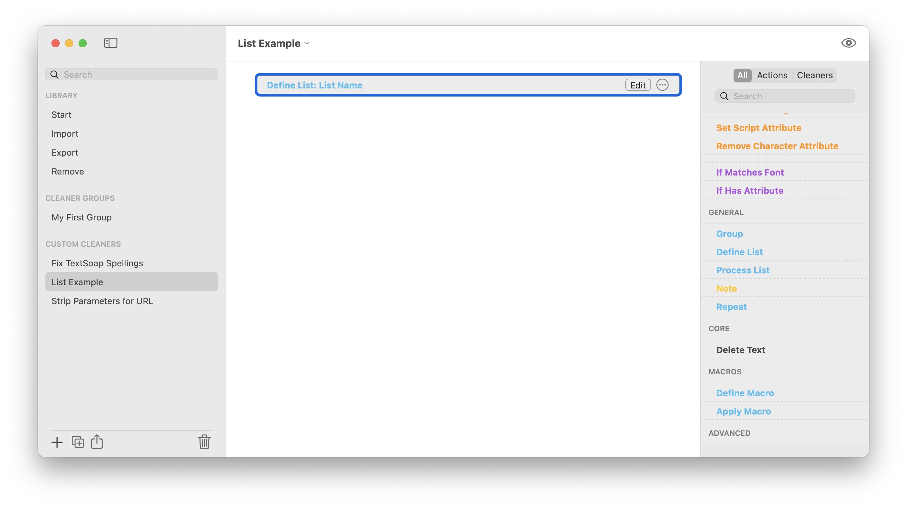

Click on Edit to add some table data. We set the column count to 2. Column A will be company names, and column B will be the associated URLs.

We will fill it with following data:

```markdown
Unmarked Software    https://www.unmarked.com
Apple    https://www.apple.com
TextSoap    https://textsoap.com/
```

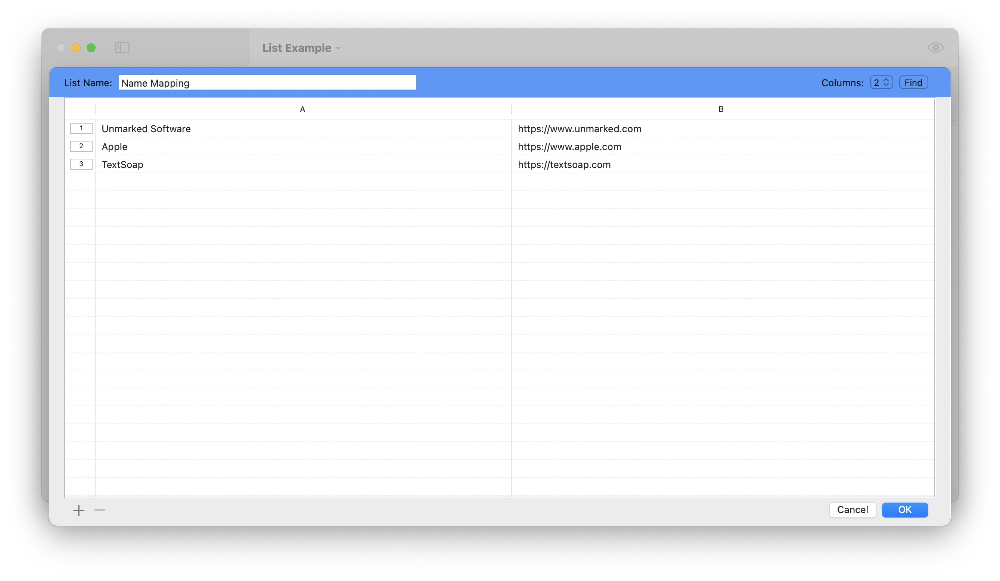

For this example, we have any entry for Unmarked Software, Apple, and TextSoap.

To use a list, you add a **Process List** container action. Then add the action(s) you want to be processed using the list data. The cleaner will process each row in the list, passing the data to each of the actions contained.

Now add a `Create Hyperlink URLs` action and specify we want match column A (**`$v{A}`**) and add the hyperlink indicated by column B (**`$v{B}`**).

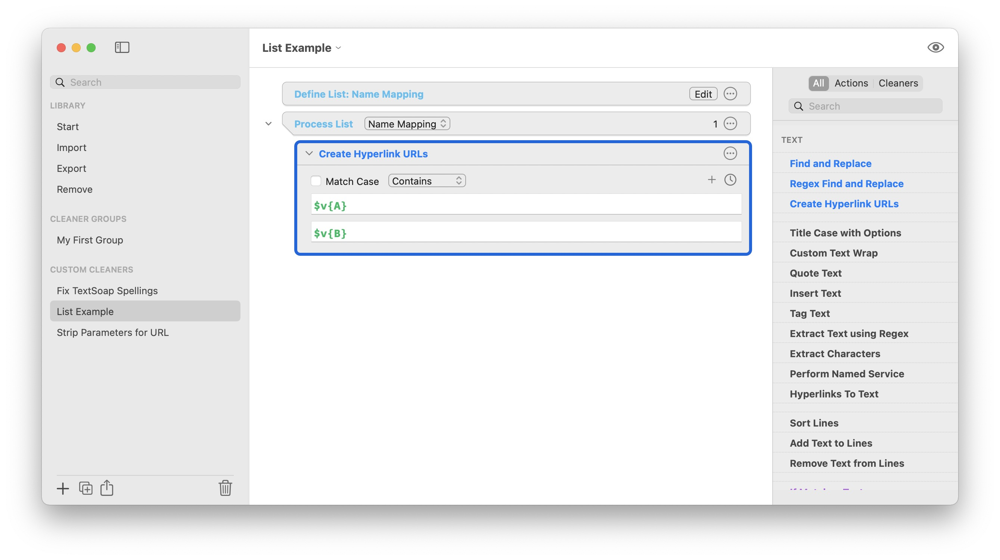

#### Sample text

---

Unmarked Software prepares for the release of the latest Windows update from Microsoft. TextSoap 9 has been tested and looks to be compatible.

---

Because we want to create hyperlinks, we need to to make sure the clipboard workspace we test against is defined as rich text.

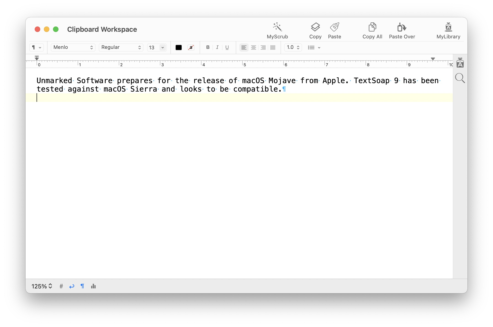

And here's what the preview looks like:

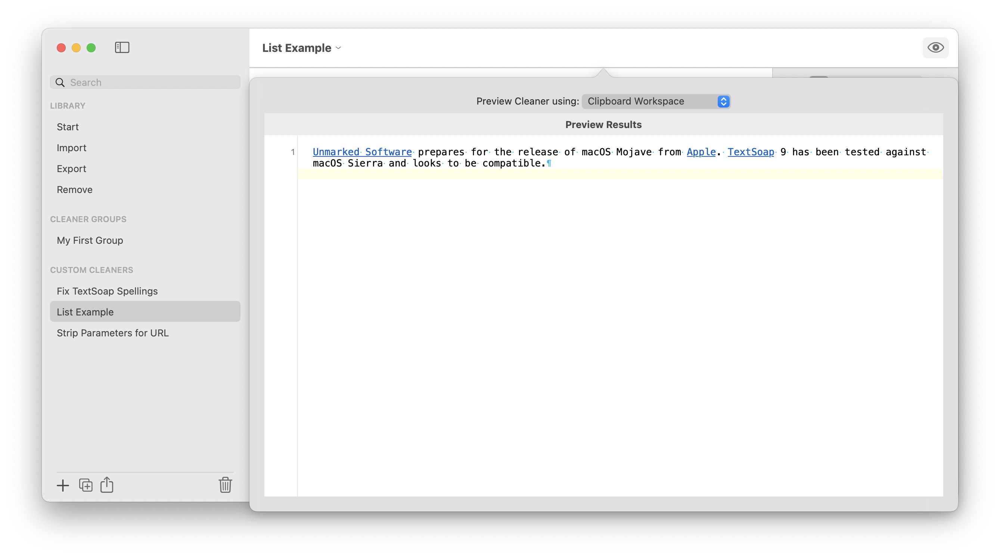

With this cleaner, we can now add a name and URL to the list data to handle more hyperlinks.

You can also copy and paste the Define List action to another cleaner if you want to use the data somewhere else.

# Matching Typefaces, Attributes

## Tutorial

TextSoap is great for finding and replacing text, but you can also change text based on its style attributes.

In this tutorial, we will use conditionals to match text with specific character style and then change the underlying text.

We will focus on a common request, converting bold and italic text to text with specified HTML tags.

### Sample text:

---

Here is some text that is **bold** or _italic_ or **_both_**. It can even be <u>underlined</u>.

---

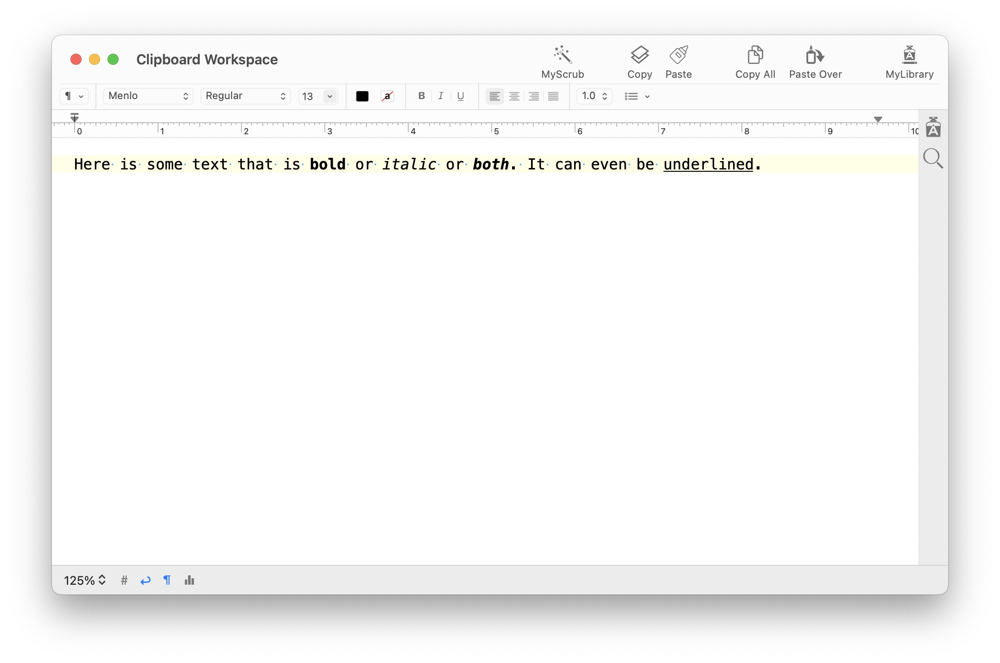

Start by creating a new cleaner called `HTML Tags for Text Styles`

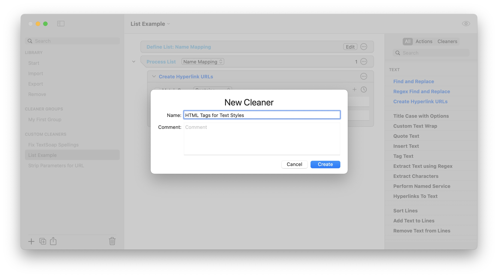

#### Tagging Bold Text

To match bold text, start by adding **If Matches Font** action. The action matches specific font family, typeface (like bold, italic) and size as specified.

This is a category of actions known as **Conditionals**. With it, you can match a subset of the text, then perform a series of actions on that subset. Since we are looking for bold text, we select the `Typeface` option and select `Bold`.

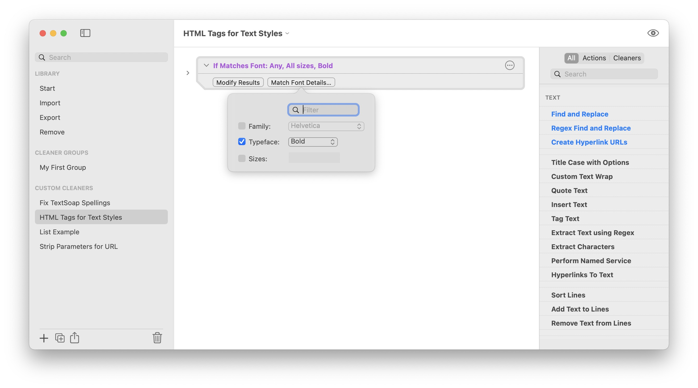

We'll apply the cleaner **HTML Tag: Bold** to any found bold text.

**Tip:** To easily add cleaners to a conditional, select the conditional, then double-click on the action or apply cleaner you wish to embed. This will add the action at the end of the list inside the conditional.

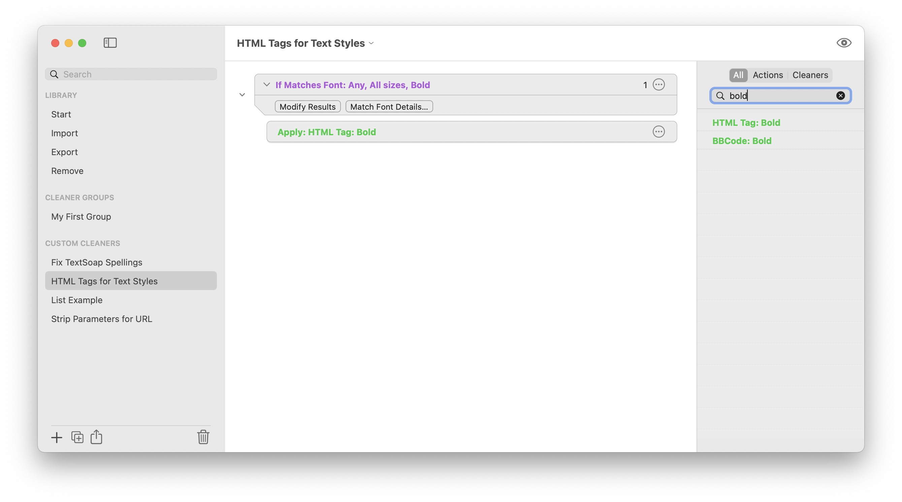

**Alternate:** You could use `HTML Tag: Strong` instead, as needed.

Now you can test it with the sample text:

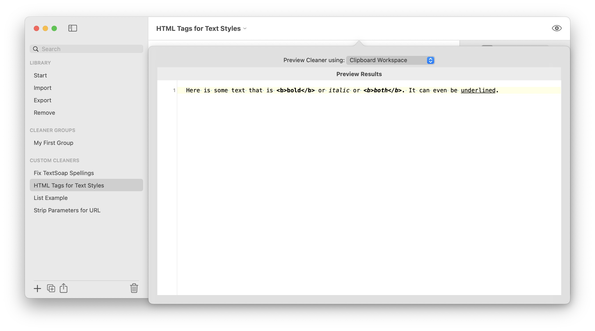

#### Tagging Italic Text

Next, we do a similar thing for italicized text. Add a new **If Matches Font** action, check **Typeface**, then select **Italics** and embed the apply cleaner action **HTML Tag: Italic** or alternatively, **HTML Tag: Emphasized**.

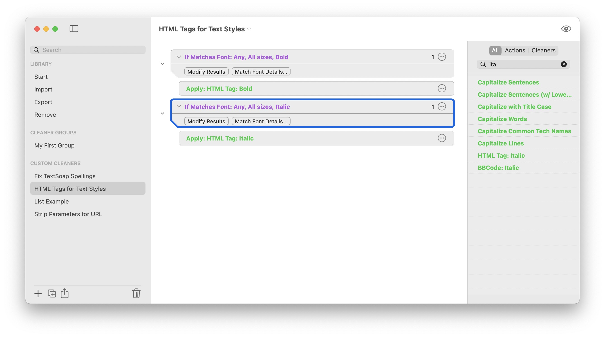

And test it again to see both italic text and bold text are tagged.

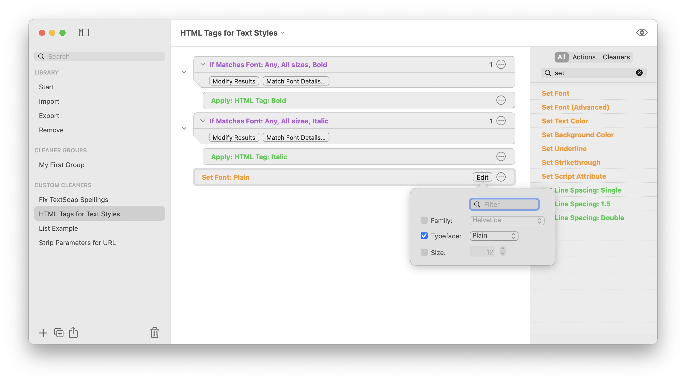

Finish by making the text plain, removing any bold or italic font. Add **Set Font** action to the end of the action list. Then select **Typeface**, then **Plain** option.

**Plain** is a special option which removes any other typefaces. Finally, test the results with the sample text.

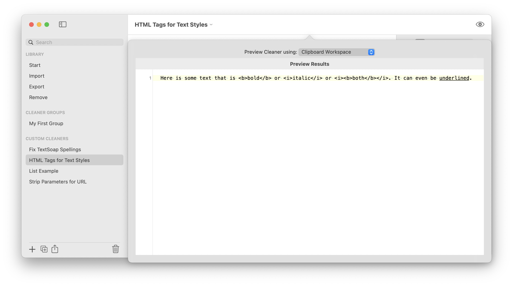

You can similarly search for underline style using the **If Has Attribute**. Each conditionally only works on that specific text.

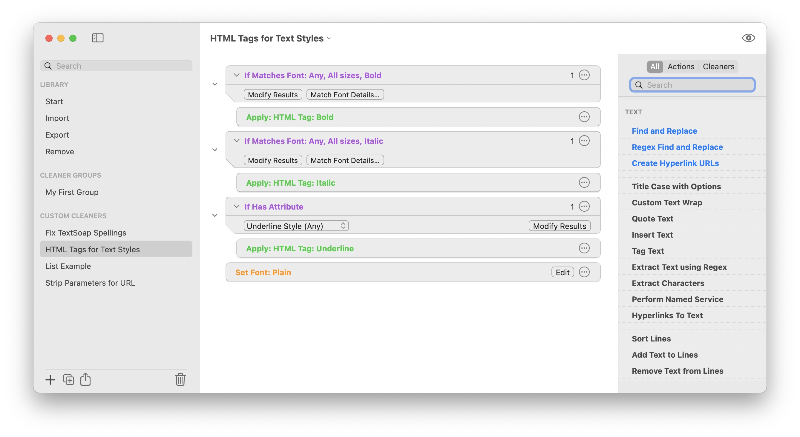

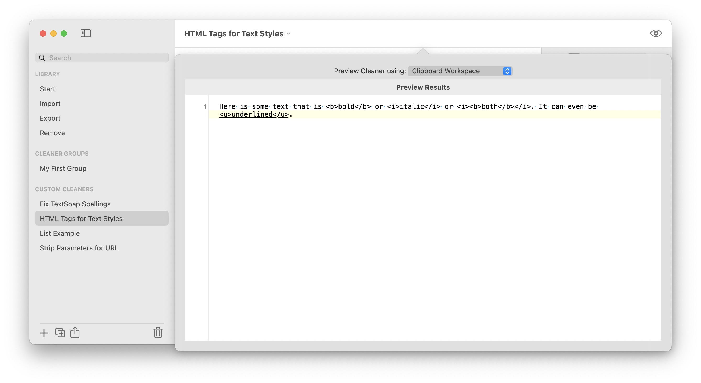

# Date-related Cleaners

**Normalize Dates to Short Format**

Normalizes Dates to Short format (format is based on Windows Regional Settings).

**Normalize Dates to Medium Format**

Normalizes Dates to Medium format (format is based on Windows Regional Settings).

**Normalize Dates to Long Format**

Normalizes Dates to Long format (format is based on Windows Regional Settings).

**Normalize Dates to Full Format**

Normalizes Dates to Full format (format is based on Windows Regional Settings).

**Normalize Dates to MM-DD-YYYY**

Normalizes Dates to MM-DD-YYYY format.

**Normalize Dates to DD-MM-YYYY**

Normalizes Dates to DD-MM-YYYY format.

**Normalize Dates to YYYY-MM-DD**

Normalizes Dates to YYYY-MM-DD format.

---

**DateNow Expansion**

DateNow Expansion is a more advanced cleaner and requires a deeper dive into how it all works, particularly beyond the basic use case.

The basic use of the DateNow Expansion cleaner is to replace `${DATENOW}` with today's date (using the localized medium date format).

`${DATENOW} = 'Apr 21, 2017'`

### Simple Formatting

DateNow expansion has some additional formatting available. You can specify one of the system formats (Short, Medium, Long, Full) by using the these forms of the DATENOW token:

`${DATENOW-SHORT} = 04/21/2017`

`${DATENOW-MEDIUM} = Apr 21, 2017`

`${DATENOW-LONG} = April 21, 2017`

`${DATENOW-FULL} = Friday, April 21, 2017`

This formatting will use the localized formatting, so it will reflect your current Windows Regional Settings and locale.

### Basic Custom Formatting

TextSoap includes three additional built-in cleaners to normalize dates, and you can specify one of these formats as well:

`${DATENOW-MM-DD-YYYY} = 04-21-2017`

`${DATENOW-DD-MM-YYYY} = 21-04-2017`

`${DATENOW-YYYY-MM-DD} = 2017-04-21`

These are all the same formats used by the various Normalize Dates cleaners.

### Using this cleaner

There are a couple ideas for using this cleaner.

- You can have text defined as `${DATENOW}` or one of the formatting variations and the cleaner will replace those with today's date.

- You may have some custom designator (like `$DATE` or `{TODAY}` ). With a custom cleaner, you can find `$DATE`, or `{TODAY}`, replace it with `${DATENOW}` and then apply the DateNow Expansion cleaner.

> > 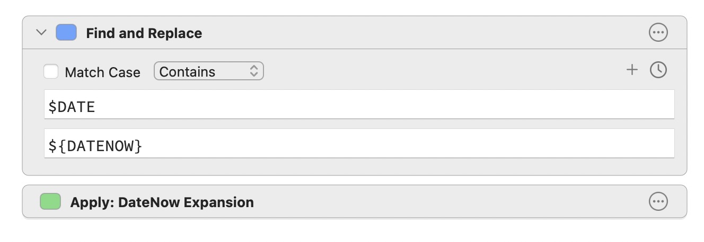

> > Tip: If you are using a regular expression, remember to escape the `$` char with a backslash `\`, since it has special meaning in both the Find AND Replace text.

> > 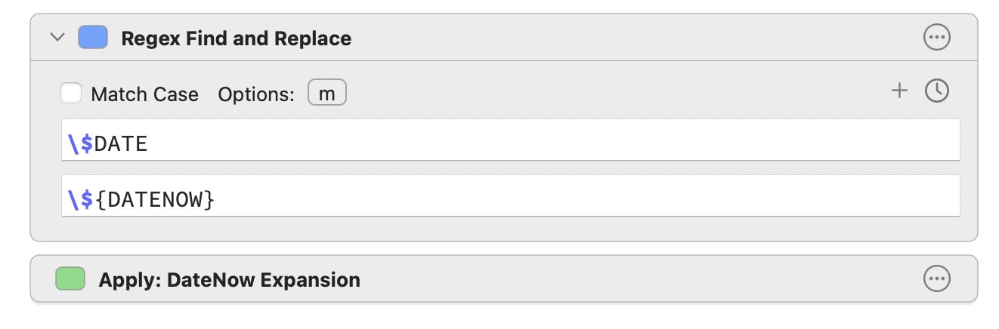

- You can also use find and replace to change `${DATENOW}` to a specific formatted version. Find `${DATENOW}` replace with `${DATENOW-LONG}` or other formatted version and then apply the DateNow Expansion cleaner.

> > 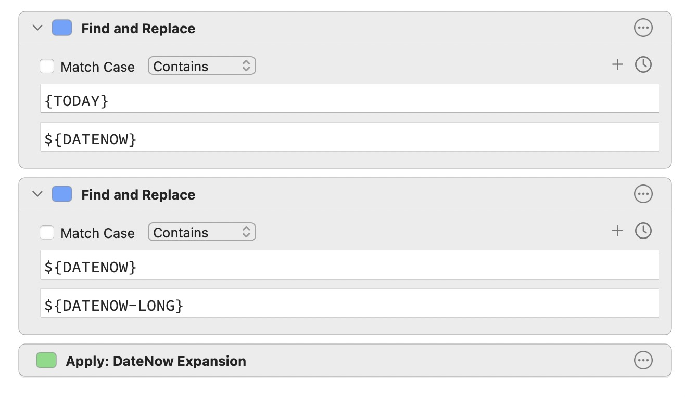

- You can insert a `${DATENOW}` token via a custom cleaner and then apply the DateNow Expansion cleaner to convert it to the current date.

# HTML Cleaners

**Extract Text from HTML Source**

Cleans up HTML raw text. It strips out anything between `<` and `>`. Extract the text contents from HTML source with this cleaner. It also handles Ampers and escape codes (  or Œ) and removes tab characters and multiple carriage returns.

---

**HTML Entity to Text**

Convert known HTML entities to their text equivalent. Supports all the standard HTML entities and most of the Unicode-based entities.

**Text to Named HTML Entity**

Convert non-ASCII text to HTML Entities. It converts character to a named entity. If a named entity cannot be found for the character, it reverts to a numeric HTML entity.

**Text to Numeric HTML Entity**

Convert non-ASCII text to HTML Entities, without attempting to find a matching named entity. The results are always numeric entities.

**All Text to Numeric HTML Entities**

Converts all standard ASCII, as well as non-ASCII, characters to numeric HTML Entities.

---

**HTML: Create Ordered List**

Converts a series of lines into an HTML-based ordered list.

**HTML: Create Unordered List**

Converts a series of lines into an HTML-based unordered list.

**HTML Tag: Bold**

Wraps the selected text in a given tag.

Sample Text:

```html
<b>Sample Text</b>
```

**HTML Tag: Italic**

Wraps the selected text in a given tag.

Sample Text:

```html
<i>Sample Text</i>
```

**HTML Tag: Preformatted**

Wraps the selected text in a given tag.

Sample Text:

```html
<pre>Sample Text</pre>
```

**HTML Tag: Break**

Inserts the break tag.

```html


```

**HTML Tag: Div**

Wraps the selected text in a given tag.

Sample Text:

```html
<div>Sample Text</div>
```

**HTML Tag: Paragraph**

Wraps the selected text in a given tag.

Sample Text:

```html
<p>Sample Text</p>
```

**HTML Tag: Span**

Wraps the selected text in a given tag.

Sample Text:

```html
<span>Sample Text</span>
```

**HTML Tag: BlockQuote**

Wraps the selected text in a given tag.

Sample Text:

```html
<blockquote>Sample Text</blockquote>
```

**HTML Tag: Cite**

Wraps the selected text in a given tag.

Sample Text:

```html
<cite>Sample Text</cite>
```

**HTML Tag: h1 - h6**

Wraps the selected text in a given tag.

Sample Text:

```html
<h1>Sample Text</h1>
..
<h6>Sample Text</h6>
```

**HTML Tag: Unordered List**

Wraps the selected text in a given tag.

Sample Text:

```html
<ul>Sample Text</ul>
```

**HTML Tag: Ordered List**

Wraps the selected text in a given tag.

Sample Text:

```html
<ol>Sample Text</ol>
```

**HTML Tag: List Item**

Wraps the selected text in a given tag.

Sample Text:

```html
<li>Sample Text</li>
```

**HTML Tag: Table**

Wraps the selected text in a given tag.

Sample Text:

```html
<table>Sample Text</table>
```

**HTML Tag: Table Row**

Wraps the selected text in a given tag.

Sample Text:

```html
<tr>Sample Text</tr>
```

**HTML Tag: Table Cell**

Wraps the selected text in a given tag.

Sample Text:

```html
<td>Sample Text</td>
```

**HTML Tag: Link**

Creates an href tag with the selected text as the URL.

http://www.unmarked.com:

```html
<a href="http://www.unmarked.com> Sample Text</a>
```

# Other Cleaner Descriptions

**SCRUB**

Multi-step cleaner addresses most common cases of extra spaces, forwarding characters, MIME encoding issues and broken paragraphs. SCRUB calls the cleaners in order to insure the best results.

**MyScrub**

A customizable version of the SCRUB version. Defined using the customize window, it allows augmenting or replacing cleaners used in SCRUB. Any available cleaner may be added to this list.

If no cleaners are specified, MyScrub defaults to SCRUB.

**Remove Extra Spaces**

Converts non-breaking spaces to standard spaces, then removes two or more spaces with a single space. Leading spaces at the beginning of a line are also removed, as are trailing spaces.

**Remove Forwarding (>) Characters**

Removes one or more sets of forwarding characters (>) on a line, commonly found in forwarded email.

**Note:** Does not yet support HTML archives, like those used in Apple Mail.

**Convert MIME-encoded Characters**

Converts %Hex or =Hex characters to their appropriate ASCII character. For example, a %20 or a =20 is converted to a space (hex 0x20 is the ASCII value of a space character).

**Make Paragraphs**

Converts multi-line paragraphs (with hard carriage returns CR) into a single paragraph. Also adds a space to the text when removing CRs to avoid smashing words together. Two or more CRs in a row indicate a new paragraph.

**Remove All Tabs**

Deletes all tabs from the selected text.

**Remove Control Characters**

Deletes any control characters (characters with an ASCII value less than 32) from the selected text (except for line feeds or carriage returns).

**Remove Extra Returns**

Converts multiple carriage returns into a single carriage return. Behaves the same as Multiple Return to 1 Return

**Uppercase**

Converts text to `UPPERCASE`.

**Lowercase**

Converts text to `lowercase`.

**Capitalize Sentences**

Converts text to lowercase, capitalizing the first character of each sentence.

**Capitalize Words**

Converts text to lowercase, then capitalizes each individual word.

**Title Case**

Converts text to `Title Case`. Words with non-standard case (iTunes, iPhone, TextSoap) remain unchanged, small words (a, an, and, as, at, but, by, en, for, if, in, of, on, or, the, to, via,) are converted to lowercase unless the word appears at the beginning or end of the line. All other words are capitalized. Create a custom cleaner with the `Title Case with Options` action to customize these options.

**Convert Bullets to ASCII**

Converts bullets to standard ASCII dashes.

**Straighten Quotes**

Converts single and double smart (or curly) quotes to straight quotes.

**Smarten Quotes**

Convert single and double straight quotes to smart (or curly) quotes.

**Expand Tabs**

Converts tabs (hex 0x09) to four (4) spaces.

**Rewrap Text**

Fixes any paragraphs (using Make Paragraphs), then rewraps the text at 70 characters per line. Behaves the same as the Wrap At 70 cleaner.

**Quote Text**

Rewraps the text and re-inserts forwarding marks (i.e.. `>`) at the beginning of each line. It also places hard returns at the end of each line to ensure proper wrapping in email applications.

**Wrap At 50**

Fixes any paragraphs (using Make Paragraphs), then rewraps the text at 50 characters per line.

**Wrap At 60**

Fixes any paragraphs (using Make Paragraphs), then rewraps the text at 60 characters per line.

**Wrap At 70**

Fixes any paragraphs (using Make Paragraphs), then rewraps the text at 70 characters per line.

**Quote Text L1**

Rewraps the text and places a single forwarding mark in front of the text.

`Sample Text` becomes `> Sample Text`.

**Quote Text L2**

Rewraps the text and places two (2) forwarding marks in front of the text.

`Sample Text` becomes `>> Sample Text`.

**Quote Text L3**

Rewraps the text and places three (3) forwarding marks in front of the text.

`Sample Text` becomes `>>> Sample Text`.

**Quote Text L4**

Rewraps the text and places four (4) forwarding marks in front of the text.

`Sample Text` becomes `>>>> Sample Text`.

**Convert to Internet Friendly Text**

Converts text to Internet Friendly Text. Diacritical values are stripped, quotes straightened, and additional characters (copyright, trademark, registered, ellipse, em-dash, en-dash) are converted to ASCII equivalents.

**Remove All High Ascii Characters**

Removes All High Ascii Characters. Strips off any ASCII values 128-256 from the text.

**1 Return to 2 Returns**

Converts each carriage return to 2 carriage returns.

**1 Return to Space**

Converts each carriage return to a space.

**Strip 2 or more Returns**

Strips any 2 or more consecutive returns to a single return.

**Strip 2 or more Spaces**

Strips any 2 or more consecutive spaces to a single space.

**Strip 2 or more Tabs**

Strips any 2 or more consecutive tabs to a single tab.

**Strip 3 or more Returns**

Strips any 3 or more consecutive returns to a single return.

**Strip 3 or more Spaces**

Strips any 3 or more consecutive spaces to a single space.

**Strip 3 or more Tabs**

Strips any 3 or more consecutive tabs to a single tab.

**Strip 4 or more Returns**

Strips any 4 or more consecutive returns to a single return.

**Strip 4 or more Spaces**

Strips any 4 or more consecutive spaces to a single space.

**Strip 4 or more Tabs**

Strips any 4 or more consecutive tabs to a single tab.

**Strip Quoting (>) Characters**

Removes the forwarding characters on a line. Same as Remove Forwarding (>) Characters.

**Multiple Return to 1 Return**

Converts multiple carriage returns to a single return.

**Multiple Return to 2 Returns**

Converts multiple carriage returns to 2 returns.

**Strip NULL**

Strips any NULL characters in the selected text.

Note: This is a remnant cleaner from 1998. Most null values are stripped out before the text is ever processed

**Ellipsis to Three periods**

Converts ellipsis characters to three periods.

**Em Dash to 2 Hyphens**

Converts Em Dash characters to two hyphens.

**En Dash to Space-Space**

Converts En Dash character to a space dash space sequence ` - `.

**Three periods to Ellipsis**

Converts three periods to an ellipsis character.

**2 Hyphens to Em Dash**

Converts two hyphens to an Em Dash character.

**Space-Space to En Dash**

Converts a space-dash-space sequence to an En Dash character.

**Remove Forwarded Text**

Delete any quoted text. Any lines of text preceded by a forwarding mark (>) are removed.

**ROT 13 Encryption**

Applies a very rudimentary encryption. Apply the encryption again to restore the text.

**String to Hexadecimal**

Converts a string of characters to a hexadecimal sequence. Use Hexadecimal to String to restore.

**Hexadecimal to String**

Converts a hexadecimal sequence to a string of characters. Use with String to Hexadecimal.

**Replace @ with (AT)**

Replaces `@` with `(AT)`.

**Increase Quote Level**

Increases the quote level of a selection by one, adding a forwarding mark (>) to the beginning of each line. Rewraps the paragraph as necessary.

**Get Version String**

Returns the current version of TextSoap.

**Windows (CRLF) Line Endings**

Converts the selected text to use Windows (CRLF) Line Endings.

**Unix (LF) Line Endings**

Converts the selected text to use Unix (LF) Line Endings.

**Legacy Mac (CR) Line Endings**

Converts the selected text to use legacy Mac (CR) Line Endings.

**Trim Beginning of Lines**

Removes any extra spaces from the beginning of the selected text lines.

**Trim End of Lines**

Removes any extra spaces from the end of the selected text lines.

**Trim Lines**

Removes any extra spaces from both the beginning and the end of the selected text lines.

**Convert Non-Breaking Spaces**

Converts Non-Breaking Spaces to standard spaces.

**Remove Style from Text**

Removes formatting style from the selected text, leaving text in a single font and style.

**Quote Based on First Line**

Quotes the selected text based on first line. The text is rewrapped. If forward marks are found at the very beginning of the text, the number found determines the level of quoting applied to that paragraph.

**Remove Hyperlinks from Text**

Removes clickable hyperlinks from the text, leaving only the text.

**Make URLs Clickable**

Finds any recognizable URLs and turns them into clickable hyperlinks.

**Extract URLs by Replacing**

Finds any recognizable URLs and extracts them, replacing the original text.

**Extract URLs by Appending**

Finds any recognizable URLs and extracts them, appending the result to the original text.

**Sort Lines in Ascending Order**

Sorts lines in increasing order. Lines are marked by paragraph markers.

**Sort Lines in Descending Order**

Sorts lines in decreasing order. Lines are marked by paragraph markers.

# Preferences

_Note: Preference options may differ based on edition._

## General

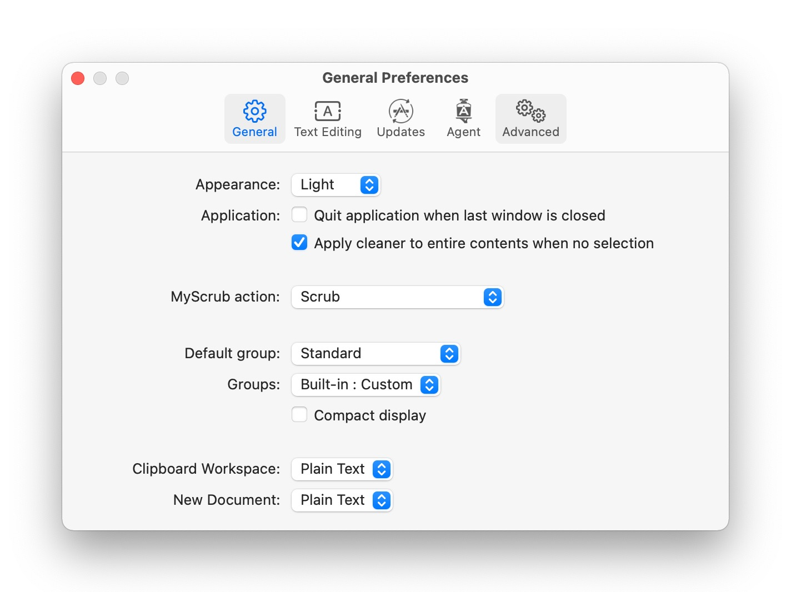

### Appearance

Specifies whether app's appearance follows System, is always light mode or always dark mode.

- System
- Light
- Dark

### Application

#### Quit application when last window is closed

Enable to automatically quit the application when the last text document is closed. This can be useful when the Clipboard Workspace (see below) is disabled.

#### Apply cleaner to entire contents when no selection

Enable to automatically apply selected cleaner to the entire document (or text contents) when no selection is found. If option is disabled, cleaners will only be applied if there is a selection.

#### MyScrub action

Specify cleaner to use when MyScrub is called. This may be Scrub (default) or any custom cleaner you create in MyLibrary.

#### Default group

Specify the default group to display when a new text window is created, whether it is the clipboard workspace, a new document or a document from file. Once the window is created, you can change the group displayed.

**Groups:** Specify which groups to display

- **Built-in:** Custom -- List built-in groups, then custom groups.
- **Custom:** Built-in -- List custom groups, then built-in groups.
- Custom -- Show only custom groups.

**Compact display:** Enable to display cleaner group using a more compact layout.

#### Clipboard Workspace

Specifies whether to use Clipboard Workspace and what format the text should be:

- Plain Text Format
- Rich Text Format
- Disabled

#### New Documents

Specify the type of document to create by default (cmd-N).

- Plain Text Document
- Rich Text Document

**Note:** You can also directly create either a rich text document (Ctrl+Shift+N) or a plain text document (Ctrl+Alt+N), bypassing this preference.

---

## Text Editing

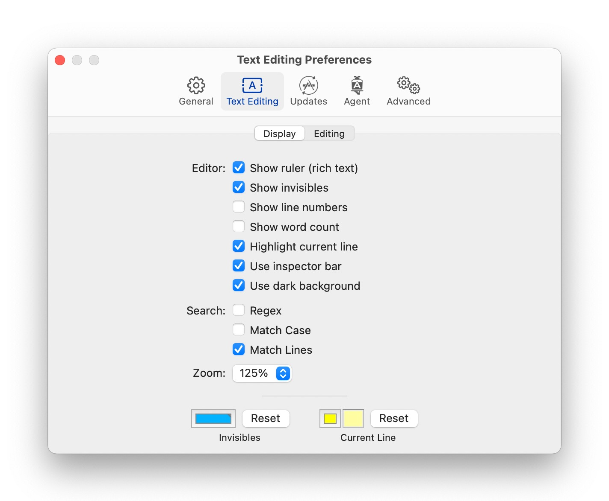

Many of these options are default values for text editor. You can later change many of these options via the Edit or View menu.

### Display

#### Editor

- **Show ruler (rich text):** Display the paragraph ruler when editing rich text. Allows changing of tab stops, as well as left, right and indent margins on a per-paragraph basis.

- **Show invisibles:** Display spaces, tabs, end of line (returns) found in the text.

- **Show line numbers:** Show the line numbers. Paragraphs are considered lines.

- **Show word count:** Display count of paragraphs (lines), words and characters. Character count without spaces is displayed in parentheses.

- **Highlight current line:** Toggles whether to highlight where cursor is.

- **Use Inspector Bar:** Use newer inspector bar and ruler interface (vs. classic)

- **Use Dark Background:** Determines if text background is dark in dark mode. Otherwise, text is displayed as black text on a white background.

#### Search

- **Regex:** Enable initial use of Regex in interactive find.

- **Match Case:** Enable match case by default (if unselected: ignore case by default).

- **Match Lines:** When using Regex interactive find, indicates whether Match Lines option is initially set, causing `^` and `$` to act as anchors for lines instead of entire text.

#### Zoom

Default zoom to use when displaying new or opened documents.

#### Invisibles

Color used to display invisible characters, such as spaces, tabs, returns, etc. Select `Default` to reset.

#### Current Line Color

Line color to use to highlight the current line. The color selected is blended together (to insure text remains readable), the result is shown next to the color selection. Select `Default` to reset.

### Editing

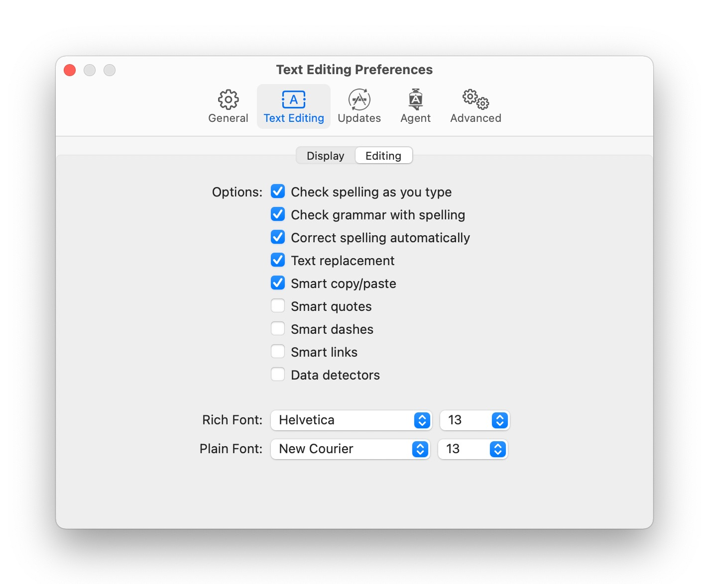

#### Options

- **Check spelling as you type:** Enable the automatic spell checker to mark potentially misspelled words as they are entered into the document.

- **Check grammar with spelling:** Use the system's grammar checker when spell checking.

- **Correct spelling automatically:** Allow for automatic correction of words with the spell checker.

- **Text replacement:** Automatic substitution of a variety of static text items based on user preferences. You can specify replacements in Windows Settings > Time & Language > Typing.

- **Smart copy/paste:** Controls whether the receiver inserts or deletes space around selected words so as to preserve proper spacing and punctuation.

- **Smart quotes:** Automatic quote substitution causes ASCII quotation marks and apostrophes to be automatically replaced, on a context-dependent basis, with more typographically accurate symbols.

- **Smart dashes:** Enables automatic conversion of a two ASCII hyphen (-) characters into an em-dash.

- **Smart links:** Causes text representing URLs typed in to be automatically made into hyperlinks.

- **Data detectors:** Automatic data detection enables detection of dates, addresses, and phone numbers.

#### Rich Text Font

Specify the default font when creating new Rich text editor. If the editor (for either Clipboard Workspace or Text documents) is a plain text editor, it will use Plain Text Font.

#### Plain Text Font

Specify the default font when creating or opening plain text documents.

---

## Updates

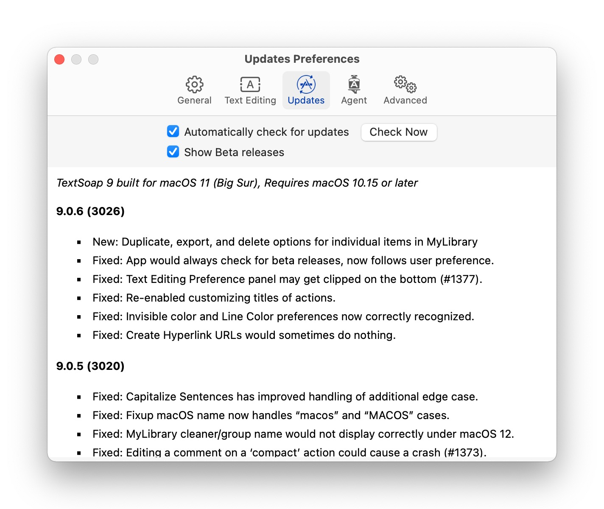

**Note: Only applies to Direct edition. Updates in other editions use their specific mechanism. Beta releases are not available in other editions.**

#### Automatically check for updates

Recommended to remain on. When selected, this option will regularly check for any software updates.

#### Check Now

Immediately check for any updates available.

#### Show Beta Releases

When selected, this option will include beta updates as well as official updates. Recommended only for advanced users.

---

## Advanced

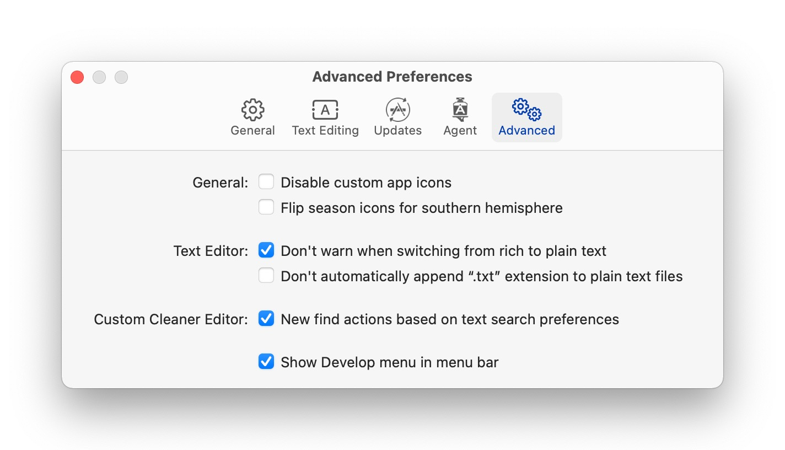

Some more advanced functionality provided. Made available in the case they are needed. Some of the options may require a relaunching of the application to take full effect.

### General

#### Disable Custom App Icons

Turns off special day icons and seasonal icons.

#### Flip Season Icons for Southern Hemisphere

Some of our customers live south of the equator where the seasons are reversed. So when we enjoy Spring, they are enjoying Fall. This flips the icons to match those seasonal dates better.

### Text Editor

#### Don't warn when switching from rich to plain text

Switching converting a document from rich text to plain text will throw away any style information with the text. Normally a warning is put up every time the conversion is selected. Enable this option to perform the conversion without a warning.

### Custom Cleaner Editor

#### New find action based on text search preferences

When adding a new Find action within a custom cleaner, this option determines whether to use the search preferences set in Text Editing panel. Useful to override the `Match Lines` and `Match Case` options for Regex (if you are so inclined).

# Batch File Cleaning

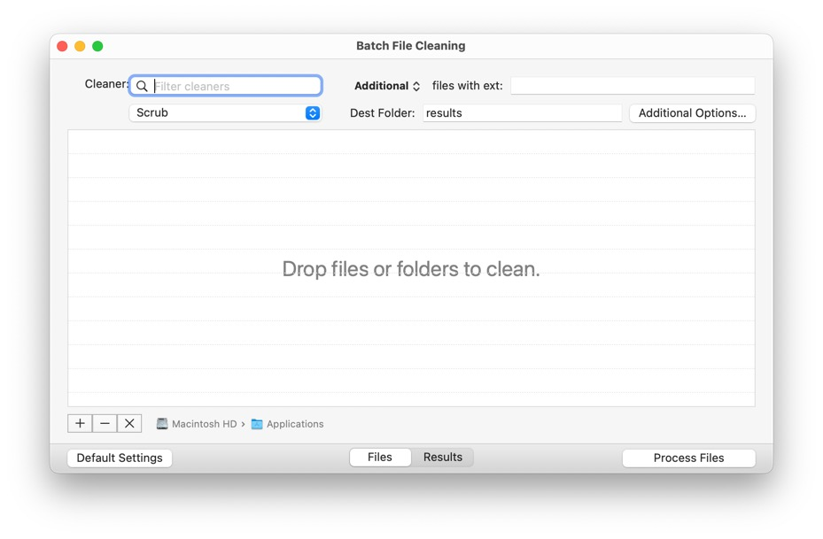

Batch file cleaning provides an interactive ability to clean files using the TextSoap application.

**Filter**

Use the filter to limit the cleaner popup to find your specific cleaner.

**Cleaner**

The cleaner you wish to apply to the files.

**Additional / Only** & **Files with ext:**

TextSoap typically processes .RTF and .TEXT documents. If you have a text file with a non-standard extension that isn't being recognized, you can add the extension to the list (space separated).

The popup allows you to specify additional extensions, or to only allow the specified extensions.

**Dest Folder**

Specify the destination folder. By default, the name is `results` which will create a sub-folder in the given source location for processed files. If you wish to results to overwrite the files in the same folder, delete the default value and leave it empty.

**Additional Options**

These options all for less common options when using batch file cleaning. See below.

**Files**

The files area allows you to view the files to be processed. You can either drag the files directly into the table or select the + to add files. You can also remove selected files or clear out the entire list.

**Results**

The results area displays a log of the files processed.

**Default Settings**

This option will reset the batch file cleaning to its initial state, removing any changes made to the settings.

**Process Files**

This action will begin processing the files, applying the specified cleaner to the list of files dropped into the list.

## Additional Options:

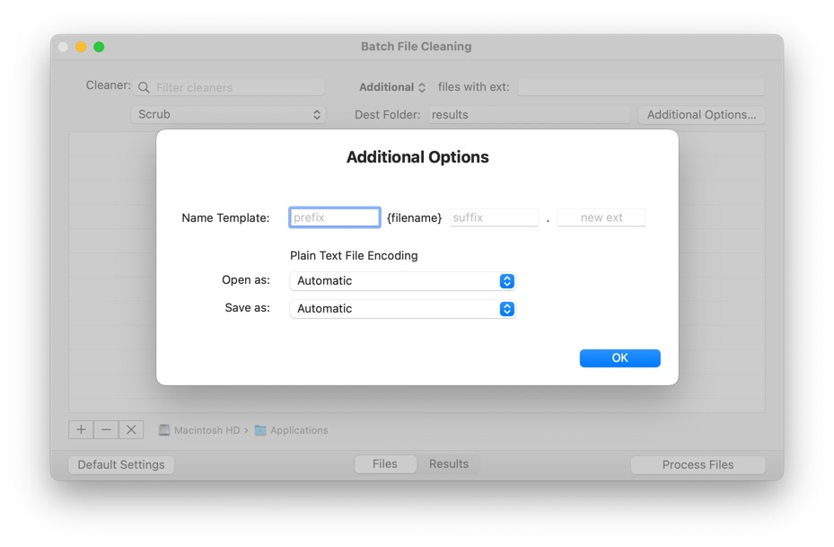

**Name Template**

You can specify any additional _prefix_, _suffix_, or _new extension_ for the cleaned file.

**Plain Text File Encoding**

You can optionally use the specified encoding for opening and saving files. When set to Automatic, it will try to use the best guess the system and determine from the file's type, falling back to UTF-8 if it cannot match anything else.

# Glossary

### Action

Action is the core unit in TextSoap text processing. An action represents an individual step taken to transform the provided text. Some action examples:

- Find and Replace Text
- Rewrap Text
- Apply (an existing) Cleaner

Other apps sometimes refer to these as a `filter`.

Actions are stored in with a cleaner (see Cleaner definition).

### Cleaner

A cleaner is one or more actions applied to text. It is the item you interact with when 'cleaning' text. There are two types of cleaners:

1. **Built-in:** pre-defined cleaners provided with the application. There are current over 100 built-in cleaners.
2. **Custom:** user-defined cleaners you either create or import.

### Clipboard Workspace

The Clipboard Workspace represents an editable representations of the clipboard contents when the app launched. When you launch TextSoap, the contents of the clipboard will be pasted into the Workspace.

You can then apply any cleaners to that text, search and replace text, or manually edit it as you would any text document.

When you quit the TextSoap, the app will automatically copy the contents of the Clipboard Workspace back to the clipboard.

This behavior can be controlled in Preferences > General.

### Group

A group is a collection of cleaners. A group can be used to organize specific cleaners based on a task or general need. When using the companion app, textsoapAgent, you can also use a custom group to define which cleaners will be used for custom services. Like cleaners, there are two types of groups:

1. **Built-in:** collections organized based on common functionality such as typography, HTML-related or Email-related.
2. **Custom:** user-defined groups you create for your own workflow, task needs.

### Text Editing

TextSoap uses the standard Windows text editing environment to provide you with a full featured text editor that can handle both plain text and rich text. If you use Notepad or WordPad, Windows' default text editor apps, you know the fundamentals of TextSoap's text editor.

There are a few additions added to help you in the process of cleaning up text:

- **Show Invisibles:** show lurking spaces, tabs, end-of-line markers and more
- **Show Line Numbers:** navigate the various lines of text
- **Wrap Text:** control whether to soft-wrap paragraphs or not. Unwrapped text will flow horizontally.
- **Statistics:** understand the basic structure of the text you are working with.

# Regular Expression Syntax

TextSoap uses the ICU (International Components for Unicode) Regular Expression syntax with some custom extensions (for case changing).

For your convenience, the regular expression syntax from the ICU documentation is included below. When in doubt, you should refer to the official ICU User Guide - Regular Expressions documentation page.

#### See Also

[ICU User Guide - Regular Expressions](http://userguide.icu-project.org/strings/regexp)

[Unicode Technical Standard #18 - Unicode Regular Expressions](http://www.unicode.org/reports/tr18/)

### Metacharacters

| Character                    | Description                                                  |
| ---------------------------- | ------------------------------------------------------------ |
| `\a`                         | Match a BELL, `\u0007`                                       |
| `\A`                         | Match at the beginning of the input. Differs from `^` in that `\A` will not match after a new-line within the input. |
| `\b`, outside of a `[Set]`   | Match if the current position is a word boundary. Boundaries occur at the transitions between word `\w` and non-word `\W` characters, with combining marks ignored. |
| `\b`, within a `[Set]`       | Match a BACKSPACE, `\u0008`.                                 |
| `\B`                         | Match if the current position is not a word boundary.        |
| `\cx`                        | Match a `Control-x` character.                               |
| `\d`                         | Match any character with the Unicode General Category of Nd (Number, Decimal Digit). |
| `\D`                         | Match any character that is not a decimal digit.             |
| `\e`                         | Match an ESCAPE, `\u001B`.                                   |
| `\E`                         | Terminates a `\Q…\E` quoted sequence.                        |
| `\f`                         | Match a FORM FEED, `\u000C`.                                 |
| `\G`                         | Match if the current position is at the end of the previous match. |
| `\n`                         | Match a LINE FEED, `\u000A`.                                 |
| `\N{Unicode Character Name}` | Match the named Unicode Character.                           |
| `\p{Unicode Property Name}`  | Match any character with the specified Unicode Property.     |
| `\P{Unicode Property Name}`  | Match any character not having the specified Unicode Property. |
| `\Q`                         | Quotes all following characters until `\E`.                  |
| `\r`                         | Match a CARRIAGE RETURN, `\u000D`.                           |
| `\s`                         | Match a white space character. White space is defined as `[\t\n\f\r\p{Z}]`. |
| `\S`                         | Match a non-white space character.                           |
| `\t`                         | Match a HORIZONTAL TABULATION, `\u0009`.                     |
| `\uhhhh`                     | Match the character with the hex value hhhh.                 |
| `\Uhhhhhhhh`                 | Match the character with the hex value `hhhhhhhh`. Exactly eight hex digits must be provided, even though the largest Unicode code point is `\U0010ffff`. |
| `\w`                         | Match a word character. Word characters are `[\p{Ll}\p{Lu}\p{Lt}\p{Lo}\p{Nd}]`. |
| `\W`                         | Match a non-word character.                                  |
| `\x{h…}`                     | Match the character with hex value `hhhh`. From one to six hex digits may be supplied. |
| `\xhh`                       | Match the character with two digit hex value `hh`.           |
| `\X`                         | Match a [Grapheme Cluster](http://www.unicode.org/reports/tr29/#Grapheme_Cluster_Boundaries). |
| `\Z`                         | Match if the current position is at the end of input, but before the final line terminator, if one exists. |
| `\z`                         | Match if the current position is at the end of input.        |
| `\n`                         | Back Reference. Match whatever the nth capturing group matched. n must be a number ≥ 1 and ≤ total number of capture groups in the pattern. **Note:** Octal escapes, such as `\012`, are not supported. |
| `[pattern]`                  | Match any one character from the set. See [ICU Regular Expression Character Classes](#icu-regular-expression-character-classes) for a full description of what may appear in the pattern. |
| `.`                          | Match any character.                                         |
| `^`                          | Match at the beginning of a line.                            |
| `$`                          | Match at the end of a line.                                  |
| `\`                          | Quotes the following character. Characters that must be quoted to be treated as literals are: `* ? + [ ( ) { } ^ $ |\ . /` |

### Operators

| Operator           | Description                                                  |
| ------------------ | ------------------------------------------------------------ |
| `|`                | Alternation. `A` `|` `B` matches either `A` or `B`.                                           |
| `*`                | Match zero or more times. Match as many times as possible.   |
| `+`                | Match one or more times. Match as many times as possible.    |
| `?`                | Match zero or one times. Prefer one.                         |
| `{n}`              | Match exactly `n` times.                                     |
| `{n,}`             | Match at least `n` times. Match as many times as possible.   |
| `{n,m}`            | Match between n and m times. Match as many times as possible, but not more than m. |
| `*?`               | Match zero or more times. Match as few times as possible.    |
| `+?`               | Match one or more times. Match as few times as possible.     |
| `??`               | Match zero or one times. Prefer zero.                        |
| `{n}?`             | Match exactly `n` times.                                     |
| `{n,}?`            | Match at least `n` times, but no more than required for an overall pattern match. |
| `{n,m}?`           | Match between `n` and m times. Match as few times as possible, but not less than `n`. |
| `*+`               | Match zero or more times. Match as many times as possible when first encountered, do not retry with fewer even if overall match fails. Possessive match. |
| `++`               | Match one or more times. Possessive match.                   |
| `?+`               | Match zero or one times. Possessive match.                   |
| `{n}+`             | Match exactly `n` times. Possessive match.                   |
| `{n,}+`            | Match at least `n` times. Possessive match.                  |
| `{n,m}+`           | Match between `n` and `m` times. Possessive match.           |
| `(…)`              | Capturing parentheses. Range of input that matched the parenthesized subexpression is available after the match. |
| `(?:…)`            | Non-capturing parentheses. Groups the included pattern, but does not provide capturing of matching text. Somewhat more efficient than capturing parentheses. |
| `(?>…)`            | Atomic-match parentheses. First match of the parenthesized subexpression is the only one tried; if it does not lead to an overall pattern match, back up the search for a match to a position before the (?> . |
| `(?#…)`            | Free-format comment (?#comment).                             |
| `(?=…)`            | Look-ahead assertion. True if the parenthesized pattern matches at the current input position, but does not advance the input position. |
| `(?!…)`            | Negative look-ahead assertion. True if the parenthesized pattern does not match at the current input position. Does not advance the input position. |
| `(?<=…)`           | Look-behind assertion. True if the parenthesized pattern matches text preceding the current input position, with the last character of the match being the input character just before the current position. Does not alter the input position. The length of possible strings matched by the look-behind pattern must not be unbounded (no `*` or `+` operators). |
| `(?<!…)`           | Negative Look-behind assertion. True if the parenthesized pattern does not match text preceding the current input position, with the last character of the match being the input character just before the current position. Does not alter the input position. The length of possible strings matched by the look-behind pattern must not be unbounded (no `*` or `+` operators). |
| `(?ismwx-ismwx:…)` | Flag settings. Evaluate the parenthesized expression with the specified flags enabled or -disabled. |
| `(?ismwx-ismwx)`   | Flag settings. Change the flag settings. Changes apply to the portion of the pattern following the setting. For example, `(?i)` changes to a case insensitive match. |

#### See Also

[ICU User Guide - Regular Expressions](http://userguide.icu-project.org/strings/regexp)

### ICU Regular Expression Character Classes

The following was originally from ICU User Guide - UnicodeSet, but has been adapted to fit the needs of this documentation. Specifically, the ICU UnicodeSet documentation describes an ICU C++ object— UnicodeSet. The term UnicodeSet was effectively replaced with Character Class, which is more appropriate in the context of regular expressions. As always, you should refer to the original, official documentation when in doubt.

#### See Also

[ICU User Guide - UnicodeSet](http://userguide.icu-project.org/strings/unicodeset)

[UTS #18 Unicode Regular Expressions - Subtraction and Intersection](http://www.unicode.org/reports/tr18/#Subtraction_and_Intersection)

[UTS #18 Unicode Regular Expressions - Properties](http://www.unicode.org/reports/tr18/#Categories)

### Overview

A character class is a regular expression pattern that represents a set of Unicode characters or character strings. The following table contains some example character class patterns:

| Pattern        | Description                                                 |
| -------------- | ----------------------------------------------------------- |
| `[a-z]`        | The lower case letters `a` through `z`                      |
| `[abc123]`     | The six characters `a, b, c, 1, 2`, and `3`                 |
| `[\p{Letter}]` | All characters with the Unicode General Category of Letter. |

#### String Values

In addition to being a set of Unicode code point characters, a character class may also contain string values. Conceptually, a character class is always a set of strings, not a set of characters. Historically, regular expressions have treated `[…]` character classes as being composed of single characters only, which is equivalent to a string that contains only a single character.

#### Character Class Patterns

Patterns are a series of characters bounded by square brackets that contain lists of characters and Unicode property sets. Lists are a sequence of characters that may have ranges indicated by a - between two characters, as in a-z. The sequence specifies the range of all characters from the left to the right, in Unicode order. For example, `[a c d-f m]` is equivalent to `[a c d e f m]`. Whitespace can be freely used for clarity as `[a c d-f m]` means the same as `[acd-fm]`.

Unicode property sets are specified by a Unicode property, such as `[:Letter:]`. ICU version 2.0 supports General Category, Script, and Numeric Value properties (ICU will support additional properties in the future). For a list of the property names, see the end of this section. The syntax for specifying the property names is an extension of either POSIX or Perl syntax with the addition of =value. For example, you can match letters by using the POSIX syntax `[:Letter:]`, or by using the Perl syntax `\p{Letter}`. The type can be omitted for the Category and Script properties, but is required for other properties.

The following table lists the standard and negated forms for specifying Unicode properties in both POSIX or Perl syntax. The negated form specifies a character class that includes everything but the specified property. For example, `[:^Letter:]` matches all characters that are not `[:Letter:]`.

| Syntax Style | Standard         | Negated               |
| ------------ | ---------------- | --------------------- |
| POSIX        | `[:type=value:]` | `[:&#94;type=value:]` |
| Perl         | `\p{type=value}` | `\P{type=value}`      |

#### See Also

[UTS #18 Unicode Regular Expressions - Properties](http://www.unicode.org/reports/tr18/#Categories)

Character classes can then be modified using standard set operations— Union, Inverse, Difference, and Intersection.

- To union two sets, simply concatenate them. For example, `[[:letter:] [:number:]]`
- To intersect two sets, use the & operator. For example, `[[:letter:] & [a-z]]`
- To take the set-difference of two sets, use the - operator. For example, `[[:letter:] - [a-z]]`
- To invert a set, place a `^` immediately after the opening `[`. For example, `[^a-z]`. In any other location, the `^` does not have a special meaning.

The binary operators & and - have equal precedence and bind left-to-right. Thus `[[:letter:]-[a-z]-[\u0100-\u01FF]]` is equivalent to `[[[:letter:]-[a-z]]-[\u0100-\u01FF]]`. Another example is the set `[[ace][bdf] - [abc][def]]` is not the empty set, but instead the set [def]. This only really matters for the difference operation, as the intersection operation is commutative.

Another caveat with the `&` and `-` operators is that they operate between sets. That is, they must be immediately preceded and immediately followed by a set. For example, the pattern `[[:Lu:]-A]` is illegal, since it is interpreted as the set `[:Lu:]` followed by the incomplete range `-A`. To specify the set of uppercase letters except for `A`, enclose the `A` in a set: `[[:Lu:]-[A]]`.

| Pattern         | Description                                                  |
| --------------- | ------------------------------------------------------------ |
| `[a]`           | The set containing `a`.                                      |
| `[a-z]`         | The set containing `a` through `z` and all letters in between, in Unicode order. |
| `[^a-z]` | The set containing all characters but `a` through `z`, that is, `U+0000` through `a-1` and `z+1` through `U+FFFF`. |
| `[[pat1][pat2]]`  | The union of sets specified by `pat1` and `pat2`.            |
| `[[pat1]&[pat2]]` | The intersection of sets specified by `pat1` and `pat2`.     |
| `[[pat1]-[pat2]]` | The asymmetric difference of sets specified by `pat1` and `pat2`. |
| `[:Lu:]`        | The set of characters belonging to the given Unicode category. In this case, Unicode uppercase letters. The long form for this is `[:UppercaseLetter:]`. |
| `[:L:]`         | The set of characters belonging to all Unicode categories starting with L, that is, `[[:Lu:][:Ll:][:Lt:][:Lm:][:Lo:]]`. The long form for this is `[:Letter:]`. |

#### See Also

[UTS #18 Unicode Regular Expressions - Subtraction and Intersection](http://www.unicode.org/reports/tr18/#Subtraction_and_Intersection)

#### String Values in Character Classes

String values are enclosed in `{curly brackets}`. For example:

| Pattern            | Description                                                  |
| ------------------ | ------------------------------------------------------------ |
| `[abc{def}]`       | A set containing four members, the single characters `a`, `b`, and `c` and the string `def` |
| `[{abc}{def}]`     | A set containing two members, the string `abc` and the string `def`. |
| `[{a}{b}{c}][abc]` | These two sets are equivalent. Each contains three items, the three individual characters `a`, `b`, and `c`. A {string} containing a single character is equivalent to that same character specified in any other way. |

#### Character Quoting and Escaping in ICU Character Class Patterns

##### Single Quote

Two single quotes represent a single quote, either inside or outside single quotes. Text within single quotes is not interpreted in any way, except for two adjacent single quotes. It is taken as literal text— special characters become non-special. These quoting conventions for ICU character classes differ from those of Perl or Java. In those environments, single quotes have no special meaning, and are treated like any other literal character.

##### Backslash Escapes

Outside of single quotes, certain backslashed characters have special meaning:

| Pattern      | Description                                |
| ------------ | ------------------------------------------ |
| `\uhhhh`     | Exactly 4 hex digits; `h` in `[0-9A-Fa-f]` |
| `\Uhhhhhhhh` | Exactly 8 hex digits                       |
| `\xhh`       | 1-2 hex digits                             |
| `\ooo`       | 1-3 octal digits; `o` in `[0-7]`           |
| `\a`         | `U+0007` BELL                              |
| `\b`         | `U+0008` BACKSPACE                         |
| `\t`         | `U+0009` HORIZONTAL TAB                    |
| `\n`         | `U+000A` LINE FEED                         |
| `\v`         | `U+000B` VERTICAL TAB                      |
| `\f`         | `U+000C` FORM FEED                         |
| `\r`         | `U+000D` CARRIAGE RETURN                   |
| `\`          | `U+005C` BACKSLASH                         |

Anything else following a backslash is mapped to itself, except in an environment where it is defined to have some special meaning. For example, `\p{Lu}` is the set of uppercase letters. Any character formed as the result of a backslash escape loses any special meaning and is treated as a literal. In particular, note that `\u` and `\U` escapes create literal characters.

#### Whitespace

Whitespace, as defined by the ICU API, is ignored unless it is quoted or backslashed.

#### Property Values

The following property value styles are recognized:

| Style  | Description                                                  |
| ------ | ------------------------------------------------------------ |
| Short  | Omits the `=type` argument. Used to prevent ambiguity and only allowed with the Category and Script properties. |
| Medium | Uses an abbreviated type and value.                          |
| Long   | Uses a full type and value.                                  |

If the type or value is omitted, then the `=` equals sign is also omitted. The short style is only used for Category and Script properties because these properties are very common and their omission is unambiguous.

In actual practice, you can mix type names and values that are omitted, abbreviated, or full. For example, if Category=Unassigned you could use what is in the table explicitly, `\p{gc=Unassigned}`, `\p{Category=Cn}`, or `\p{Unassigned}`.

When these are processed, case and whitespace are ignored so you may use them for clarity, if desired. For example, `\p{Category = Uppercase Letter}` or `\p{Category = uppercase letter}`.

For a list of properties supported by ICU, see [ICU User Guide - Unicode Properties](http://userguide.icu-project.org/strings/properties).

#### See Also

[ICU User Guide - Unicode Properties](http://userguide.icu-project.org/strings/properties)


[UTS #18 Unicode Regular Expressions - Properties](http://www.unicode.org/reports/tr18/#Categories)

### Unicode Properties

The following tables list some of the commonly used Unicode Properties, which can be matched in a regular expression with `\p{Property}`. The tables were created from the Unicode 5.2 Unicode Character Database, which is the version used by ICU that ships with Mac OS X 10.6.

#### Category

| Category | Meaning |
|----------|   |
| L        | Letter               |
| LC       | CasedLetter          |
| Lu       | UppercaseLetter      |
| Ll       | LowercaseLetter      |
| Lt       | TitlecaseLetter      |
| Lm       | ModifierLetter       |
| Lo       | OtherLetter          |
| P        | Punctuation          |
| Pc       | ConnectorPunctuation |
| Pd       | DashPunctuation      |
| Ps       | OpenPunctuation      |
| Pe       | ClosePunctuation     |
| Pi       | InitialPunctuation   |
| Pf       | FinalPunctuation     |
| Po       | OtherPunctuation     |
| N        | Number               |
| Nd       | DecimalNumber        |
| Nl       | LetterNumber         |
| No       | OtherNumber          |
| M        | Mark                 |
| Mn       | NonspacingMark       |
| Mc       | SpacingMark          |
| Me       | EnclosingMark        |
| S        | Symbol               |
| Sm       | MathSymbol           |
| Sc       | CurrencySymbol       |
| Sk       | ModifierSymbol       |
| So       | OtherSymbol          |
| Z        | Separator            |
| Zs       | SpaceSeparator       |
| Zl       | LineSeparator        |
| Zp       | ParagraphSeparator   |
| C        | Other                |
| Cc       | Control              |
| Cf       | Format               |
| Cs       | Surrogate            |
| Co       | PrivateUse           |
| Cn       | Unassigned           |


#### Script

| Arabic       | Armenian    | Balinese            |
|--------------|-------------|---------------------|
| Bengali      | Bopomofo    | Braille             |
| Buginese     | Buhid       | Canadian_Aboriginal |
| Carian       | Cham        | Cherokee            |
| Common       | Coptic      | Cuneiform           |
| Cypriot      | Cyrillic    | Deseret             |
| Devanagari   | Ethiopic    | Georgian            |
| Glagolitic   | Gothic      | Greek               |
| Gujarati     | Gurmukhi    | Han                 |
| Hangul       | Hanunoo     | Hebrew              |
| Hiragana     | Inherited   | Kannada             |
| Katakana     | Kayah_Li    | Kharoshthi          |
| Khmer        | Lao         | Latin               |
| Lepcha       | Limbu       | Linear_B            |
| Lycian       | Lydian      | Malayalam           |
| Mongolian    | Myanmar     | New_Tai_Lue         |
| Nko          | Ogham       | Ol_Chiki            |
| Old_Italic   | Old_Persian | Oriya               |
| Osmanya      | Phags_Pa    | Phoenician          |
| Rejang       | Runic       | Saurashtra          |
| Shavian      | Sinhala     | Sundanese           |
| Syloti_Nagri | Syriac      | Tagalog             |
| Tagbanwa     | Tai_Le      | Tamil               |
| Telugu       | Thaana      | Thai                |
| Tibetan      | Tifinagh    | Ugaritic            |
| Unknown      | Vai         | Yi                  |


#### Extended Property Class

| ASCII_Hex_Digit                    | Alphabetic                |
|------------------------------------|---------------------------|
| Bidi_Control                       | Dash                      |
| Default_Ignorable_Code_Point    | Deprecated                   |
| Diacritic                          | Extender                  |
| Grapheme_Base                      | Grapheme_Extend           |
| Grapheme_Link                      | Hex_Digit                 |
| Hyphen                             | IDS_Binary_Operator       |
| IDS_Trinary_Operator               | ID_Continue               |
| ID_Start                           | Ideographic               |
| Join_Control                       | Logical_Order_Exception   |
| Lowercase                          | Math                      |
| Noncharacter_Code_Point            | Other_Alphabetic          |
| Other_Default_Ignorable_Code_Point | Other_Grapheme_Extend     |
| Other_ID_Continue                  | Other_ID_Start            |
| Other_Lowercase                    | Other_Math                |
| Other_Uppercase                    | Pattern_Syntax            |
| Pattern_White_Space                | Quotation_Mark            |
| Radical                            | STerm                     |
| Soft_Dotted                        | Terminal_Punctuation      |
| Unified_Ideograph                  | Uppercase                 |
| Variation_Selector                 | White_Space               |
| XID_Continue                       | XID_Start                 |

### Unicode Character Database

Unicode properties are defined in the [Unicode Character Database](http://www.unicode.org/ucd/), or **UCD**. From time to time the UCD is [revised and updated](http://www.unicode.org/versions/). The properties available, and the definition of the characters they match, depend on the UCD that ICU was built with.

> [!NOTE]
>
> In general, the ICU and UCD versions change with each major operating system release.

#### See Also

[UTS #18 Unicode Regular Expressions - Properties](http://www.unicode.org/reports/tr18/#Categories)

[UTS #18 Unicode Regular Expressions - Compatibility Properties](http://www.unicode.org/reports/tr18/#Compatibility_Properties)

[Unicode Character Database](http://www.unicode.org/ucd/)

[The Unicode Standard - Unicode 5.2](http://www.unicode.org/versions/Unicode5.2.0/)

[Versions of the Unicode Standard](http://www.unicode.org/versions/)


### ICU Replacement Text Syntax

#### Replacement Text Syntax

| Character | Description                                                  |
| --------- | ------------------------------------------------------------ |
| `$n`      | The text of capture group n will be substituted for `$n`. `n` must be ≥ 0 and not greater than the number of capture groups. A `$` not followed by a digit has no special meaning, and will appear in the substitution text as itself, a `$`. |
| `\`       | Treat the character following the backslash as a literal, suppressing any special meaning. Backslash escaping in substitution text is only required for `$` and `\`, but may proceed any character. The backslash itself will not be copied to the substitution text. |

##### Case Change During Replacement

TextSoap includes some additional processing commands which allow you to dynamically change the case of your replacement. This is similar to PCRE (which are typically preceded with `\`, ie. `\U`, `\u`, `\L`, `\l`, `\E`). In TextSoap, these commands are preceded with a `$` (dollar sign).

| Cmd  | Action                            |
| ---- | --------------------------------- |
| `$U` | All future text is uppercased     |
| `$u` | Next character is uppercased      |
| `$L` | All future text is lowercased     |
| `$l` | Next character is lowercased      |
| `$E` | All future text case is preserved |
